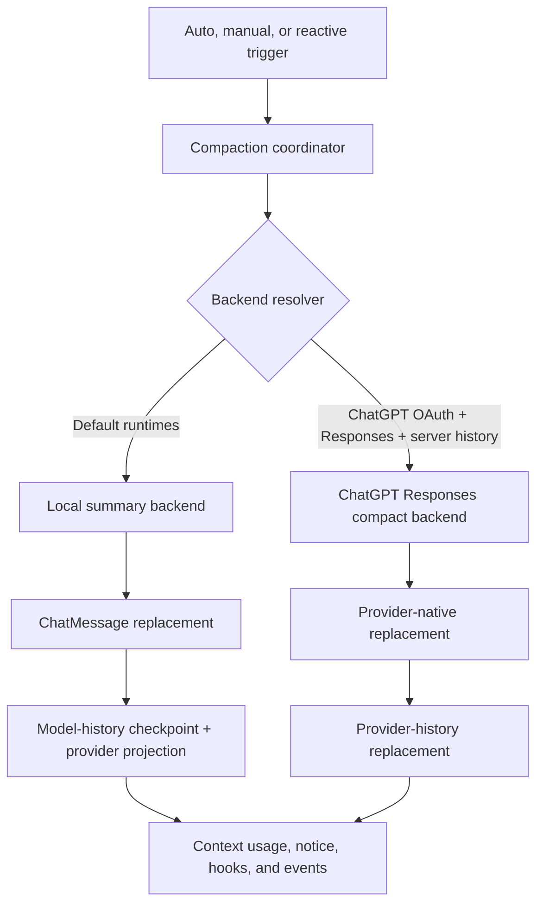

# Context Compaction Pipeline

| Field | Value |
|---|---|
| **Version** | 0.1.0 |
| **Status** | Draft |
| **Date** | 2026-07-31 |
| **Parent Specs** | [Session Core](session-core.md), [Model Runtime](model-runtime.md), [Canonical OpenAI Responses Provider History](responses-provider-history.md), [OpenAI Subscription Auth](openai-subscription-auth.md) |

Purpose: Define the backend-neutral context compaction pipeline for DotCraft contributors. This
spec owns backend selection, replacement domains, trigger phases, failure behavior, context usage,
and recovery. Session Core owns lifecycle and public events. Provider specs own wire formats and
native history representation.

## Goals and non-goals

The pipeline must:

- select a compaction backend from the thread's effective model runtime and history mode;
- support automatic, manual, and reactive compaction through one orchestration contract;
- support both provider-neutral `ChatMessage` replacement and provider-native history replacement;
- preserve a provider-neutral history that can be used after a provider or protocol change;
- install every successful replacement as an atomic context-window transition;
- keep threshold accounting valid when a provider-native replacement cannot be represented as
  `ChatMessage`;
- expose the existing Session Core event and maintenance behavior without adding a new public
  configuration switch.

The first provider-native backend targets ChatGPT OAuth with server-managed OpenAI Responses
history. This version does not:

- decode or summarize an opaque provider compaction item locally;
- convert one provider's native records directly into another provider's records;
- use provider-native compaction for client-managed history;
- add a local fallback after a selected provider-native backend fails;
- enable Responses `context_management` server-side compaction on ordinary `/responses` requests.

## Core invariants

| Invariant | Requirement |
|---|---|
| **Neutral history remains available** | A provider-native replacement must not replace, truncate, or synthesize the canonical `ChatMessage` history. |
| **One replacement domain** | One successful attempt has either a neutral or provider-native authoritative replacement. Projecting a neutral replacement into active provider history is derived state, not a second compaction result. |
| **No cross-backend fallback** | Once backend selection succeeds, an error from that backend is a compaction failure. The coordinator must not invoke another backend. |
| **Provider ownership** | A provider adapter owns capture, validation, estimation, and installation of its native history. Generic compaction code must not interpret provider item types. |
| **Canonical provider output** | A standalone compact response is installed as a complete ordered window. Unknown and retained items remain in the returned order. |
| **Request-shape parity** | A provider-native compact request derives model, instructions, tools, reasoning, and other supported controls from the same mapping path as a normal provider request. |
| **Atomic installation** | A replacement becomes live only after its authoritative recovery record is durable. A provider-native record also carries the next context-window identity; derived state-store projections are reconciled from it. |
| **Private provider state** | Provider item JSON and encrypted content are recovery state. Events, search, export, and ordinary diagnostics must not expose them. |

## Architecture



The coordinator is above the existing local `CompactionPipeline`. The existing pipeline remains the
local summary engine for micro, partial, and full-history compaction. Provider-native backends plug
into the coordinator and return a different replacement type.

## Internal contracts

The implementation must express trigger, phase, backend, and replacement independently:

```csharp
internal enum CompactionTrigger
{
    Auto,
    Manual,
    Reactive
}

internal enum CompactionPhase
{
    PreTurn,
    MidTurn,
    Manual,
    Reactive
}

internal sealed record CompactionExecutionRequest(
    CompactionTrigger Trigger,
    CompactionPhase Phase,
    IReadOnlyList<ChatMessage> NeutralHistory,
    ChatOptions? Options,
    PromptRequestSnapshot? PromptSnapshot,
    long InputTokenHint,
    IProviderHistoryCompactionBridge? ProviderBridge);

internal sealed record CompactionExecutionResult(
    CompactionStatus Status,
    string BackendId,
    CompactionReplacement? Replacement);

internal abstract record CompactionReplacement
{
    internal sealed record Neutral(
        IReadOnlyList<ChatMessage> Messages) : CompactionReplacement;

    internal sealed record ProviderNative(
        string Protocol,
        IReadOnlyList<JsonElement> Items,
        int CoveredMessageCount,
        string? CoveredThroughTurnId,
        long EstimatedTokensAfter) : CompactionReplacement;
}
```

Names may follow repository conventions, but the information and separation above are normative.
The pre-sampling callback must return this discriminated result instead of treating every successful
attempt as a replacement `IReadOnlyList<ChatMessage>`.

A provider that supports native compaction exposes a capability equivalent to:

```csharp
internal interface IProviderHistoryCompactionBridge
{
    ValueTask<ProviderCompactionInput> CaptureCompactionInputAsync(
        CompactionPhase phase,
        IReadOnlyList<ChatMessage> messages,
        ChatOptions? options,
        CancellationToken cancellationToken);

    ValueTask ReplaceNativeAsync(
        ProviderNativeReplacement replacement,
        CancellationToken cancellationToken);

    long EstimateNativeContextTokens(
        ProviderNativeSnapshot snapshot,
        IReadOnlyList<ChatMessage> pendingTail,
        ChatOptions? options);
}
```

Capture is read-only. Previewing an uncovered `ChatMessage` tail for a compact request must not
append that tail to live provider history or emit a rollout record.

## Backend selection

Selection is internal and automatic. It is evaluated from the effective runtime at the start of
each attempt.

| Runtime | History mode | Backend |
|---|---|---|
| ChatGPT OAuth + `openai-responses` | Server-managed | `chatgpt_responses_compact` |
| API-key OpenAI Responses | Server-managed | Local summary |
| Any non-Responses protocol | Server-managed | Local summary |
| Any runtime | Client-managed | Existing request-local/local behavior; thread-level manual compaction remains unavailable |

Changing provider, model, protocol, or authentication method invalidates the cached backend
selection along with the thread agent and compaction runtime. Backend selection is not a user
configuration field.

If the selected provider-native capability is missing or corrupt, the attempt fails with
`provider_compaction_unavailable`. It must not use local summary compaction.

## Orchestration

Each attempt follows this order:

1. Resolve the effective runtime, trigger, phase, and exactly one backend.
2. Evaluate the active context using a valid provider anchor or the selected backend's estimator.
3. Run `PreCompact`. A blocked hook produces the existing skipped or failed behavior.
4. Capture an immutable input from the selected backend.
5. Execute the backend once. Backend-internal bounded authentication recovery is not another
   compaction attempt.
6. Validate the result without mutating live history.
7. Persist one replacement domain, then install it from the committed recovery record.
8. Invalidate pre-replacement token anchors and request snapshots for the replaced domain.
9. Save replacement context usage, emit the terminal event and notice, then run `PostCompact`.

Manual compaction holds thread maintenance for the complete sequence. Auto and reactive compaction
remain serialized by the active Turn and Session Gate.

## Local summary backend

The local backend wraps the existing `CompactionPipeline` behavior:

- cold-cache microcompaction may clear old tool-result content;
- partial compaction replaces an older prefix with a handoff summary;
- manual compaction may use the full-history fallback when no partial prefix exists;
- a successful result returns `CompactionReplacement.Neutral`;
- Session Core persists a model-history replacement checkpoint before making the replacement live;
- an active Responses adapter maps the final neutral replacement once into a new provider-history
  generation.

The summary content and maintenance-fork requirements remain in
[Session Core](session-core.md#local-summary-compaction-contract). Prompt-cache constraints remain
in [Prompt Cache](prompt-cache.md).

## ChatGPT Responses compact backend

### Activation

The backend is active only when all of these conditions hold:

- the effective runtime uses `AuthMethod = chatgptOAuth`;
- the effective protocol is `openai-responses`;
- the thread uses server-managed history;
- provider-history schema version 1 is active and replayable.

API-key Responses requests do not use this backend in this version, even if the public OpenAI API
supports a similarly named endpoint.

### Transport boundary

The backend calls the configured ChatGPT OAuth backend at:

```text
POST https://chatgpt.com/backend-api/codex/responses/compact
```

The implementation may use the OpenAI .NET SDK raw `CompactResponseAsync` protocol method because
the configured `ResponsesClient` already owns the effective endpoint and client pipeline. The SDK
method is transport only. Its public API request/response model is not the backend contract and SDK
CLR response items are not persisted.

DotCraft owns strongly typed request and response envelope DTOs for this transport boundary. Raw
JSON values are limited to provider-native item arrays and open nested controls whose schemas must
remain forward-compatible. Request and response envelopes must not be represented as unstructured
`JsonElement` values or inspected through ad hoc property lookup.

The transport is isolated behind `IChatGptResponsesCompactTransport`. If a future SDK version
cannot preserve the ChatGPT backend request, only that transport changes.

OAuth request classification distinguishes:

- **Responses-family requests:** `/responses` and `/responses/compact`; receive OAuth,
  account/installation, sticky session/thread, request id, window, Turn metadata, turn-state, and
  enabled beta headers;
- **Create-response requests:** `/responses` only; receive ordinary response-body canonicalization
  and `client_metadata` augmentation.

The compact request must not receive `/responses`-only `client_metadata` or streaming-body
rewrites.

### Request body

The body is projected from the same fully prepared request shape used by ordinary Responses
sampling:

| Field | Requirement |
|---|---|
| `model` | Required effective Responses model. |
| `input` | Required ordered native compaction snapshot for the selected phase. |
| `instructions` | Include when non-empty. |
| `tools` | Include the final provider-visible tool definitions when present. |
| `parallel_tool_calls` | Include the final resolved boolean. |
| `reasoning` | Include the final Responses reasoning object when present. |
| `service_tier` | Include when the effective ChatGPT request shape supplies it. |
| `prompt_cache_key` | Include the final explicit or derived cache key when present. |
| `text` | Include final text/format controls when present. |

The body does not include `stream`, `store`, `include`, `client_metadata`, or
`max_output_tokens`. Request construction must reuse the Responses mapper's ID normalization,
tool-call correlation, replayable image-generation projection, and request-local tool-pair
sanitization.

The active `x-codex-turn-state`, when present, is sent and updated through the existing OAuth
pipeline. The compact call uses request kind `compaction` while retaining the active conversation
identity: `x-client-request-id` remains the current executing Thread id.

### Response validation

A successful response must contain a non-empty `output` array whose elements are JSON objects.
DotCraft must:

- deserialize the top-level response through the provider-owned compact response DTO;
- preserve every returned element and its array order;
- preserve unknown item types and unknown properties;
- accept a window containing retained items in addition to a compaction item;
- avoid requiring exactly one `type = "compaction"` element;
- reject invalid JSON, a missing or empty `output`, and non-object elements;
- avoid converting the output through MEAI or a typed SDK response-item hierarchy.

The complete output becomes the canonical next Responses input window.

## Provider-native trigger phases and coverage

`CoveredMessageCount` describes how much of the neutral sampling list is represented by the
provider-native replacement. `CoveredThroughTurnId` describes the latest Turn boundary represented
by the replacement. They are coverage boundaries, not a claim that provider records can be
converted back into neutral messages.

`CoveredMessageCount` is the active runtime cursor. The durable replacement stores
`CoveredThroughTurnId`; cold recovery derives the neutral cursor from that Turn boundary and later
surviving provider-history appends.

| Phase | Compact input | Coverage after installation |
|---|---|---|
| **PreTurn** | Current committed native generation. Excludes the new user message that has not entered provider history. | Retains the prior native message count and covered Turn. The new user tail is appended exactly once by ordinary request preparation. |
| **MidTurn** | Current native generation plus a read-only mapping of the active Turn's uncovered tool/guidance tail. | Covers the complete current sampling list and current Turn. |
| **Manual** | The current persisted generation after protocol-return alignment, if needed. | Covers the full neutral session and latest terminal Turn represented by that generation. |
| **Reactive** | The exact native input rejected by the provider for context overflow. | Covers that submitted sampling list and the failing Turn. |

If manual compaction finds that non-Responses Turns occurred after the stored Responses generation,
Session Core first performs the existing `protocol_return` replacement from neutral history. The
remote backend then compacts that aligned native generation.

A pre-turn attempt with no committed native prefix returns `Skipped` with
`provider_compaction_empty_input`. It does not summarize a new user message by itself.

## Replacement installation

### Neutral replacement

A neutral replacement:

1. persists the replacement `ChatMessage` checkpoint and covered Turn;
2. replaces the in-memory neutral session;
3. advances the context window from the committed checkpoint;
4. rebuilds provider-native history from the neutral replacement when the active provider requires
   it.

### Provider-native replacement

A provider-native replacement:

1. allocates the next context-window/generation identity without publishing it;
2. appends one `provider_history_replaced` baseline containing the complete raw output, coverage
   Turn, protocol, generation, and reason `remote_compaction`;
3. treats that durable rollout record as the replacement commit point;
4. publishes the new provider generation and exact context-window identity only after the append
   succeeds;
5. updates the `thread_context_windows` state-store projection to the committed identity;
6. leaves the in-memory and persisted neutral `ChatMessage` history unchanged.

The rollout replacement is authoritative because it contains its own context-window identity.
`thread_context_windows` is a routing projection, not a second commit record, and is not required to
share a transaction with rollout JSONL. Cold recovery must select the newest valid replacement,
use its identity for the active Responses scope, and reconcile a stale projection before the next
request. A projection write failure after the rollout commit does not make the previous provider
generation live again.

If the rollout append fails before the commit point, the new generation must not become live and
replay continues from the previous valid generation. Provider-history schema version 1 already
accepts arbitrary JSON objects, so this replacement does not require a schema migration.

Both replacement kinds invalidate continuation tokens, prompt request snapshots, and provider usage
anchors that refer to the replaced request boundary. Both produce the existing `partial` successful
outcome, `compacted` event, and persistent compaction `SystemNotice`. A provider-native replacement
does not append a model-history compaction checkpoint.

## Context usage

Neutral history cannot estimate a provider-native compacted window because the opaque item has no
semantic `ChatMessage` representation. When a provider-native generation is active, threshold
evaluation uses a provider-native estimator.

The OpenAI Responses estimator must include:

- base instructions and final tool/request controls;
- serialized model-visible bytes for ordinary response items;
- decoded-payload estimates for `reasoning`, `compaction`, and `context_compaction`
  `encrypted_content`;
- adjusted image, audio, and encrypted tool-output payload costs;
- the mapped token estimate of any neutral tail not covered by the native generation.

After installation, Session Core saves the result as a context usage estimate with source
`provider_compacted_estimate` and `isEstimate = true`. This estimate may drive automatic compaction
because it describes the active provider generation. The next real provider usage snapshot replaces
it.

A persisted provider usage value that does not match the active generation remains display-only and
must not trigger compaction. Resetting the normal token tracker must not cause the coordinator to
estimate the complete neutral transcript while an active native replacement exists.

## Failure and cancellation

| Failure | Stable reason | Behavior |
|---|---|---|
| Native capability absent or corrupt | `provider_compaction_unavailable` | Fail selected backend; no local fallback. |
| Empty phase input | `provider_compaction_empty_input` | Skip unless the caller's blocking policy requires failure. |
| Invalid or empty response | `provider_compaction_invalid_response` | Fail selected backend; keep old generation. |
| Authentication, transport, or provider error | Existing provider error or `provider_compaction_failed` | Fail selected backend after normal bounded OAuth recovery. |
| Replacement rollout append failure | `provider_history_persist_failed` | Keep old live generation and fail the attempt. |
| Context-window projection is stale after commit | Existing state-store diagnostic | Keep the committed generation live and reconcile before the next request. |
| User cancellation during manual compaction | `cancelled` | Emit `compactCancelled`; install nothing. |

Failure policy remains trigger-specific:

- auto failure below the blocking limit emits `compactFailed` and may continue to the original
  sampling request;
- auto failure above the blocking limit fails the Turn with
  `agent_context_compaction_failed`;
- manual failure returns `outcome = "failed"`;
- reactive failure preserves the original context-overflow failure;
- reactive success still fails the Turn after installing the repaired history and asks the user to
  resend the message.

The compaction failure tracker is backend-specific. Failures from one backend must not trip another
backend's circuit breaker.

## Recovery and protocol changes

- **Cold resume:** replay the newest valid provider replacement and later surviving entries. The
  opaque output is sent directly to the next Responses request.
- **Rollback:** reject a replacement whose covered Turn no longer survives, then select an older
  valid generation.
- **Fork:** copy an exact compatible provider prefix for whole-Turn forks. Partial or incompatible
  forks materialize from neutral history.
- **Leave Responses:** retain provider history but use neutral history for the new protocol.
- **Return without intervening Turns:** reuse the valid Responses generation.
- **Return after non-Responses Turns:** create a new `protocol_return` generation from neutral
  history. Do not translate another provider's records.
- **Ephemeral thread:** apply the same state transitions in memory and persist them only through the
  normal promotion path.

The neutral transcript is the semantic interoperability fallback. It is not expected to reproduce
the token savings or hidden state of an opaque provider compaction item.

## Observability and privacy

Compaction traces may record:

- backend id, trigger, and phase;
- request and output item counts;
- serialized byte counts and token estimates;
- context-window/generation ids;
- provider request id, duration, and terminal status;
- stable failure reason.

Traces, logs, context search, previews, and ordinary export must not record provider item bodies,
encrypted content, OAuth credentials, or compact request instructions. Any existing protected-data
handling for explicitly enabled HTTP capture must apply equally to compact traffic; this backend
must not add a new unredacted logging path.

`PreCompact` and `PostCompact` run once for the logical compaction attempt. Bounded OAuth 401
recovery and SDK transport retries do not emit additional hook or Session Core lifecycle events.

## Public behavior

This design adds no public configuration or AppServer method. Existing contracts remain:

- `thread/compact/start` for manual compaction;
- `outcome = "partial"` for a successful summary-producing or provider-native replacement;
- `compacting` followed by one terminal compaction event;
- a persistent `SystemNotice` for successful partial/provider-native replacement;
- `contextUsage.source` as an extensible diagnostic string.

Clients do not need to know which backend produced the replacement.

## Acceptance checklist

- Backend selection chooses ChatGPT remote compaction only for OAuth Responses server-history
  threads.
- A selected remote backend never calls the local summary backend after failure.
- The compact request uses the ChatGPT endpoint, Responses-family OAuth headers, turn-state, and
  the ordinary Responses request-shape mapper.
- Compact body tests prove that `/responses`-only `client_metadata` and streaming fields are absent.
- Multi-item and unknown-item output survives persistence, restart, rollback, and compatible fork
  without MEAI conversion.
- Pre-turn input appends the pending user message once; mid-turn input preserves tool-call/result
  correlation.
- Manual compaction works after cold resume and after protocol-return alignment.
- Reactive compaction installs the rejected native request's compacted replacement while preserving
  the existing failed-Turn/resend behavior.
- Provider-native replacement leaves neutral history byte-for-byte equivalent at the model-history
  codec boundary.
- Switching providers uses neutral history and never exposes or translates the opaque item.
- Provider-native usage estimation prevents immediate repeated compaction and is replaced by the
  next real provider usage snapshot.
- Auth, malformed-response, cancellation, and pre-commit rollout failures leave the previous
  generation replayable.
- The existing local compaction test suite remains unchanged in behavior.
- A credential-gated integration test confirms that `/responses/compact` output is accepted as the
  next ChatGPT OAuth `/responses` input.

## Related specs

- [Session Core](session-core.md)
- [Canonical OpenAI Responses Provider History](responses-provider-history.md)
- [OpenAI Subscription Auth](openai-subscription-auth.md)
- [Prompt Cache](prompt-cache.md)
- [AppServer Protocol](../protocols/appserver-protocol.md)
