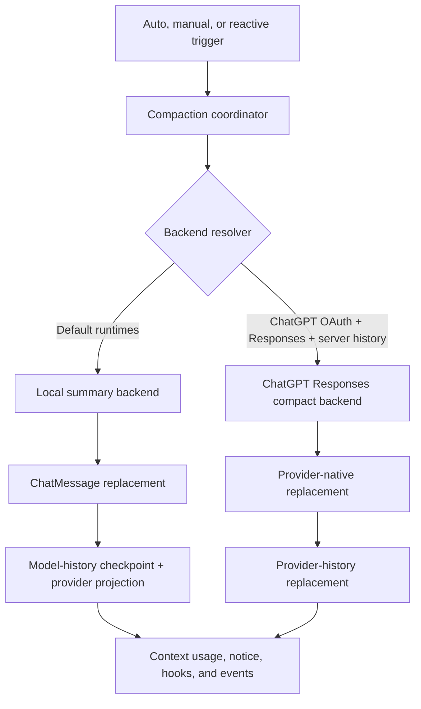

# Context Compaction Pipeline

| Field | Value |
|---|---|
| **Version** | 0.7.8 |
| **Status** | Draft |
| **Date** | 2026-09-28 |
| **Parent Specs** | [Session Core](session-core.md), [Model Runtime](model-runtime.md), [Canonical OpenAI Responses Provider History](responses-provider-history.md), [OpenAI Subscription Auth](openai-subscription-auth.md) |

Purpose: Define the backend-neutral context compaction pipeline for DotCraft contributors. This
spec owns backend selection, replacement domains, trigger phases, failure behavior, context usage,
and recovery. Session Core owns lifecycle and public events. Provider specs own wire formats and
native history representation.

## Goals and non-goals

The pipeline must:

- select a compaction backend from the thread's effective model runtime and history mode;
- support automatic, manual, and reactive compaction through one orchestration contract;
- support both provider-neutral `ChatMessage` replacement and provider-native history replacement;
- preserve a provider-neutral history that can be used after a provider or protocol change;
- install every successful replacement as an atomic context-window transition;
- keep threshold accounting valid when a provider-native replacement cannot be represented as
  `ChatMessage`;
- expose the existing Session Core event and maintenance behavior; the only public configuration
  this pipeline adds is the turn-end threshold `Compaction.PostTurnCompactThresholdPercent`.

The first provider-native backend targets ChatGPT OAuth with server-managed OpenAI Responses
history. This version does not:

- decode or summarize an opaque provider compaction item locally;
- convert one provider's native records directly into another provider's records;
- use provider-native compaction for client-managed history;
- add a local fallback after a selected provider-native backend fails;
- enable Responses `context_management` server-side compaction on ordinary `/responses` requests.

## Core invariants

| Invariant | Requirement |
|---|---|
| **Neutral history remains available** | A provider-native replacement must not replace, truncate, or synthesize the canonical `ChatMessage` history. |
| **One replacement domain** | One successful attempt has either a neutral or provider-native authoritative replacement. Projecting a neutral replacement into active provider history is derived state, not a second compaction result. |
| **No cross-backend fallback** | Once backend selection succeeds, an error from that backend is a compaction failure. The coordinator must not invoke another backend. |
| **Provider ownership** | A provider adapter owns capture, validation, estimation, and installation of its native history. Generic compaction code must not interpret provider item types. |
| **Canonical provider output** | A standalone compact response is installed as a complete ordered window. Unknown and retained items remain in the returned order. |
| **Request-shape parity** | A provider-native compact request derives model, instructions, tools, reasoning, and other supported controls from the same mapping path as a normal provider request. |
| **Atomic installation** | A replacement becomes live only after its authoritative recovery record is durable. A provider-native record also carries the next context-window identity; derived state-store projections are reconciled from it. |
| **Private provider state** | Provider item JSON and encrypted content are recovery state. Events, search, export, and ordinary diagnostics must not expose them. |

## Architecture

```mermaid
flowchart TD
    trigger["Auto, manual, or reactive trigger"] --> coordinator["Compaction coordinator"]
    coordinator --> resolver{"Backend resolver"}
    resolver -->|"Default runtimes"| local["Local summary backend"]
    resolver -->|"ChatGPT OAuth + Responses + server history"| remote["ChatGPT Responses compact backend"]
    local --> neutral["ChatMessage replacement"]
    remote --> native["Provider-native replacement"]
    neutral --> neutralInstall["Model-history checkpoint + provider projection"]
    native --> nativeInstall["Provider-history replacement"]
    neutralInstall --> lifecycle["Context usage, notice, hooks, and events"]
    nativeInstall --> lifecycle
```

The coordinator selects one backend; each backend returns its authoritative replacement domain.

## Internal contracts

An attempt carries its trigger (`Auto`, `Manual`, or `Reactive`), phase, immutable neutral history,
request options, context estimate, and any provider-native capability. Trigger and phase are distinct.

The result identifies the backend and outcome. Successful replacement is a discriminated choice:

- **Neutral:** ordered model-visible messages.
- **Provider-native:** protocol, ordered native items, covered message count and Turn, and replacement
  token estimate.

The provider owns read-only capture, replacement validation and installation, and native context
estimation. Capture may preview an uncovered neutral tail but must not mutate live history or emit
rollout records. The coordinator must not treat native replacement as neutral messages.

## Backend selection

Selection is internal and automatic. It is evaluated from the effective runtime at the start of
each attempt.

| Runtime | History mode | Backend |
|---|---|---|
| ChatGPT OAuth + `openai-responses` | Server-managed | `chatgpt_responses_compact` |
| API-key OpenAI Responses | Server-managed | Local summary |
| Any non-Responses protocol | Server-managed | Local summary |
| Any runtime | Client-managed | Existing request-local/local behavior; thread-level manual compaction remains unavailable |

Changing provider, model, protocol, or authentication method invalidates the cached backend
selection along with the thread agent and compaction runtime. Backend selection is not a user
configuration field.

If the selected provider-native capability is missing or corrupt, the attempt fails with
`provider_compaction_unavailable`. It must not use local summary compaction.

## Orchestration

Each attempt follows this order:

1. Resolve the effective runtime, trigger, phase, and exactly one backend.
2. Evaluate the active context using a valid provider anchor or the selected backend's estimator.
3. Run `PreCompact`. A blocked hook produces the existing skipped or failed behavior.
4. Capture an immutable input from the selected backend.
5. Execute the backend once. Backend-internal bounded authentication recovery is not another
   compaction attempt.
6. Validate the result without mutating live history.
7. Persist one replacement domain, then install it from the committed recovery record.
8. Invalidate pre-replacement token anchors and request snapshots for the replaced domain.
9. Save replacement context usage, emit the terminal event and notice, then run `PostCompact`.

Manual compaction holds thread maintenance for the complete sequence. Auto and reactive compaction
remain serialized by the active Turn and Session Gate.

## Automatic trigger phases

Automatic compaction runs at three boundaries of a Turn. Each phase fixes what the compaction
input contains and which Turn the resulting replacement covers. A replacement never covers a Turn
later than its covered Turn: rollback that removes later Turns keeps it, and rollback that removes
the covered Turn discards it.

| Phase | When | Input | Covered Turn |
|---|---|---|---|
| **PreTurn** | At Turn start, after the persisted model history is loaded and instruction or guidance reconciliation is applied, before the Turn's context items and user input are appended. | The persisted neutral history only. | The newest surviving terminal Turn (`Completed`, `Failed`, or `Cancelled`); the current Turn when the Thread has no terminal Turn. |
| **MidTurn** | Every sampling boundary inside the Turn, including the first one when the new input itself crosses the threshold. | The complete sampling list. | The current Turn. |
| **PostTurn** | After the final assistant response, before the Turn reaches its terminal status. Requires `Compaction.PostTurnCompactThresholdPercent` above zero and a post-response active context at or above the auto threshold or `EffectiveContextWindow × percent / 100`. Skipped while the Turn is cancelling or queued inputs are pending. | The complete Turn history including the final response. | The current Turn. |

After a PreTurn replacement, the Turn's context items and user input are persisted as the current
Turn's model-history batch behind the checkpoint, so a later rollback of that Turn removes only the
batch. A PostTurn replacement is committed together with the Turn's terminal state. A PostTurn
failure emits `compactFailed`, keeps the completed Turn, and never fails it.

## Local summary backend

The local backend wraps the existing `CompactionPipeline` behavior:

- cold-cache microcompaction may clear old tool-result content;
- partial compaction replaces an older prefix with a handoff summary;
- manual compaction may use the full-history fallback when no partial prefix exists;
- a successful result returns `CompactionReplacement.Neutral`;
- Session Core persists a model-history replacement checkpoint before making the replacement live;
- an active Responses adapter maps the final neutral replacement once into a new provider-history
  generation.

The summary request consumes only the snapshot or trimmed message list supplied by the local
compaction pipeline. It may retain the active thread identity and prompt-cache routing, but it must
not read from or append to the active Responses provider-history generation. That generation is
used again only when Session Core projects the successful neutral replacement.

Prompt-cache constraints follow [Prompt Cache](prompt-cache.md).

### Local Summary Compaction Contract

Local partial and full compaction install their synthetic handoff summary with the User role. The
summary establishes an input boundary before the retained tail; it must not impersonate an Assistant
response lacking provider-required reasoning. This affects new replacements only.

Context compaction is a short-term context-window optimization, not long-term memory.

- The compact summary is a handoff for the next model-visible history. It should preserve only the current task, key decisions, important files read or changed, critical errors/fixes, constraints, and concrete next steps needed to continue.
- Summary prompts must target a bounded output budget and must not request an unbounded chronological analysis of every message.
- Summary prompts must not require a separate `<analysis>` drafting block. An `<analysis>` block returned by a provider anyway is stripped.
- Summary prompts must not require listing all user messages or embedding full code snippets by default. They may ask for the smallest necessary excerpt only when exact text is required to continue the task.
- Every compaction request uses a compact-specific `MaxOutputTokens` budget defined in the configuration schema; it must not inherit the ordinary turn output budget. Snapshot compaction forks must also cap their requested output to the compact-specific budget even when preserving the cache-sensitive input prefix, so a maintenance summary cannot inherit a normal Turn's larger output allowance.
- Cache-sharing snapshot forks and context-usage anchors should keep cache-sensitive request parameters stable when possible, but a snapshot or anchor is usable only while its captured messages remain a prefix of the current canonical model-visible history and its request-shape fingerprint still matches. Any successful history replacement (auto, reactive, or manual compaction; rollback; deletion) invalidates older snapshots and anchors. Maintenance forks should attempt the provider request first so prompt-cache-aware providers can reuse the captured prefix only when the estimated snapshot request fits the maintenance input budget. If the snapshot estimate is over budget, or if the provider rejects the snapshot request with a conservatively classified prompt-too-long / context-overflow error, the fork returns `maintenance_snapshot_too_large` and falls back to a trimmed non-cache path when one exists. An otherwise empty response containing provider error content returns a terminal maintenance-fork response with `maintenance_empty_error_response` and must also fall back to the trimmed non-cache path for compaction. Other provider, authentication, rate-limit, model, or request-shape errors must not be reclassified as context overflow.
- If automatic pre-sampling compaction fails while the original context estimate is still over the blocking limit, Session Core must fail the Turn explicitly with a stable `agent_context_compaction_failed` error instead of continuing to the main provider request. This prevents a too-large context from producing a silent `turn_completed` after a failed maintenance fork.
- Snapshot forks enforce summary length through the prompt and by validating the returned summary. A summary that exceeds the compact-specific hard budget is treated as `compact_summary_too_long` and must fall back to a non-cache path or report `compactFailed`.
- Compaction model-call cancellation, provider/network timeout, and overlong summaries must be observable in trace storage with a terminal maintenance-fork response. Manual compaction maps user cancellation to `compactCancelled`; provider timeout and overlong/invalid summary map to `compactFailed` with machine-readable `message` values.
- A successful neutral history replacement must persist a recovery checkpoint containing the replacement model-visible history and the newest covered Turn. A pre-turn replacement covers the newest surviving terminal Turn; mid-turn, turn-end, and reactive replacements cover the current Turn. A provider-native replacement instead persists `provider_history_replaced` and leaves neutral model history unchanged. Later recovery and rollback select the newest replacement in the relevant domain whose covered Turn still survives in the canonical Thread.

## ChatGPT Responses compact backend

### Activation

The backend is active only when all of these conditions hold:

- the effective runtime uses `AuthMethod = chatgptOAuth`;
- the effective protocol is `openai-responses`;
- the thread uses server-managed history;
- provider-history schema version 1 is active and replayable.

API-key Responses requests do not use this backend in this version, even if the public OpenAI API
supports a similarly named endpoint.

### Responses v2 transport and request

The backend uses the configured OAuth `POST /responses` streaming transport, including the
standard or Lite dialect selected for ordinary sampling. It appends exactly one request-local
`{"type":"compaction_trigger"}` after the immutable native input snapshot. The trigger is never
persisted. The existing Responses mapper and OAuth pipeline own tools, instructions, reasoning,
service tier, prompt cache, client metadata, streaming flags, and conversation routing.

`IChatGptResponsesCompactTransport` uses the SDK raw create-response protocol method and consumes
raw SSE events. It must not pass compaction through the normal chat adapter or tool loop, which
would append provider outputs or execute tools in the live conversation. There is no legacy
`/responses/compact` or local-summary fallback for this backend.

### Completion and replacement

A successful stream must reach `response.completed` after exactly one `compaction` item has been
observed in `response.output_item.done`. Missing or duplicate compaction items, malformed events,
`response.failed`, `response.incomplete`, errors, and premature EOF fail the attempt. Extra output
items are ignored and never executed. Preserve the selected item's unknown fields and encrypted
content as raw JSON; do not round-trip it through SDK response-item types or MEAI.

Build the next native window from the captured input, retaining user messages and client developer
context in order, followed by the new compaction item. Exclude old reasoning, assistant output,
tool calls/results, old compaction items, and request-local tool/instruction injection. The retained
message budget is 64,000 estimated tokens using the provider-native estimator, including media.
Select newest messages first and stop at the budget boundary. A boundary message may truncate text
on Unicode boundaries but must not split media payloads; remove whole content items when needed.
Unknown fields in retained messages survive unchanged except for the selected boundary content.
The replacement estimate includes this complete window and request overhead.

The active turn-state and request kind `compaction` use the existing OAuth pipeline. Completion
metadata (response id, usage, duration, terminal status, and protocol version) is diagnostic only;
it does not alter the provider-history schema or neutral transcript.

## Provider-native trigger phases and coverage

`CoveredMessageCount` describes how much of the neutral sampling list is represented by the
provider-native replacement. `CoveredThroughTurnId` describes the latest Turn boundary represented
by the replacement. They are coverage boundaries, not a claim that provider records can be
converted back into neutral messages.

The sampling list includes persisted AGENTS.md instruction messages and uses the same history
sanitizer as ordinary sampling. All compaction callers preserve the complete list and request
snapshot. Removing AGENTS.md is a local-summary backend policy applied after backend selection;
the filtered snapshot's message fingerprint is recomputed. Native coverage must not be shortened
by this policy. Manual context usage estimates include the complete provider-visible history.

Reactive compaction retains the failed turn's provider context beyond sampling-scope disposal and
uses the final captured sampling snapshot, including sanitizer repairs. The failed turn remains
failed after compaction; the user can resubmit against the compacted history.

`CoveredMessageCount` is the active runtime cursor. The durable replacement stores
`CoveredThroughTurnId`; cold recovery derives the neutral cursor from that Turn boundary and later
surviving provider-history appends.

| Phase | Compact input | Coverage after installation |
|---|---|---|
| **PreTurn** | Current committed native generation. Excludes the new user message that has not entered provider history. | Retains the prior native message count and covered Turn. The new user tail is appended exactly once by ordinary request preparation. |
| **MidTurn** | Current native generation plus a read-only mapping of the active Turn's uncovered tool/guidance tail. | Covers the complete current sampling list and current Turn. |
| **PostTurn** | Current native generation plus a read-only mapping of the complete current Turn, including the final assistant response. | Covers the complete current sampling list and current Turn. |
| **Manual** | The current persisted generation after protocol-return alignment, if needed. | Covers the full neutral session and latest terminal Turn represented by that generation. |
| **Reactive** | The exact native input rejected by the provider for context overflow. | Covers that submitted sampling list and the failing Turn. |

If manual compaction finds that non-Responses Turns occurred after the stored Responses generation,
Session Core first performs the existing `protocol_return` replacement from neutral history. The
remote backend then compacts that aligned native generation.

A pre-turn attempt with no committed native prefix returns `Skipped` with
`provider_compaction_empty_input`. It does not summarize a new user message by itself.

## Replacement installation

### Neutral replacement

A neutral replacement:

1. persists the replacement `ChatMessage` checkpoint and covered Turn;
2. replaces the in-memory neutral session;
3. advances the context window from the committed checkpoint;
4. rebuilds provider-native history from the neutral replacement when the active provider requires
   it.

### Provider-native replacement

A provider-native replacement:

1. allocates the next context-window/generation identity without publishing it;
2. appends one `provider_history_replaced` baseline containing the complete client-built replacement, coverage
   Turn, protocol, generation, and reason `remote_compaction`;
3. treats that durable rollout record as the replacement commit point;
4. publishes the new provider generation and exact context-window identity only after the append
   succeeds;
5. updates the `thread_context_windows` state-store projection to the committed identity;
6. leaves the in-memory and persisted neutral `ChatMessage` history unchanged.

The rollout replacement is authoritative because it contains its own context-window identity.
`thread_context_windows` is a routing projection, not a second commit record, and is not required to
share a transaction with rollout JSONL. Cold recovery must select the newest valid replacement,
use its identity for the active Responses scope, and reconcile a stale projection before the next
request. A projection write failure after the rollout commit does not make the previous provider
generation live again.

If the rollout append fails before the commit point, the new generation must not become live and
replay continues from the previous valid generation. Provider-history schema version 1 already
accepts arbitrary JSON objects, so this replacement does not require a schema migration.

Both replacement kinds invalidate continuation tokens, prompt request snapshots, and provider usage
anchors that refer to the replaced request boundary. Both produce the existing `partial` successful
outcome, `compacted` event, and persistent compaction `SystemNotice`. A provider-native replacement
does not append a model-history compaction checkpoint.

## Context usage

Neutral history cannot estimate a provider-native compacted window because the opaque item has no
semantic `ChatMessage` representation. When a provider-native generation is active, threshold
evaluation uses a provider-native estimator.

The OpenAI Responses estimator must include:

- base instructions and final tool/request controls;
- serialized model-visible bytes for ordinary response items;
- decoded-payload estimates for `reasoning`, `compaction`, and `context_compaction`
  `encrypted_content`;
- adjusted image, audio, and encrypted tool-output payload costs;
- the mapped token estimate of any neutral tail not covered by the native generation.

After installation, Session Core saves the result as a context usage estimate with source
`provider_compacted_estimate` and `isEstimate = true`. This estimate may drive automatic compaction
because it describes the active provider generation. The next real provider usage snapshot replaces
it.

A persisted provider usage value that does not match the active generation remains display-only and
must not trigger compaction. Resetting the normal token tracker must not cause the coordinator to
estimate the complete neutral transcript while an active native replacement exists.

## Failure and cancellation

| Failure | Stable reason | Behavior |
|---|---|---|
| Native capability absent or corrupt | `provider_compaction_unavailable` | Fail selected backend; no local fallback. |
| Empty phase input | `provider_compaction_empty_input` | Skip unless the caller's blocking policy requires failure. |
| Invalid or empty response | `provider_compaction_invalid_response` | Fail selected backend; keep old generation. |
| Authentication, transport, or provider error | Existing provider error or `provider_compaction_failed` | Fail selected backend after normal bounded OAuth recovery. |
| Replacement rollout append failure | `provider_history_persist_failed` | Keep old live generation and fail the attempt. |
| Context-window projection is stale after commit | Existing state-store diagnostic | Keep the committed generation live and reconcile before the next request. |
| User cancellation during manual compaction | `cancelled` | Emit `compactCancelled`; install nothing. |

Failure policy remains trigger-specific:

- auto failure below the blocking limit emits `compactFailed` and may continue to the original
  sampling request;
- auto failure above the blocking limit fails the Turn with
  `agent_context_compaction_failed`;
- manual failure returns `outcome = "failed"`;
- reactive failure preserves the original context-overflow failure;
- reactive success still fails the Turn after installing the repaired history and asks the user to
  resend the message.

The compaction failure tracker is backend-specific. Failures from one backend must not trip another
backend's circuit breaker.

## Recovery and protocol changes

- **Cold resume:** replay the newest valid provider replacement and later surviving entries. The
  opaque output is sent directly to the next Responses request.
- **Rollback:** reject a replacement whose covered Turn no longer survives, then select an older
  valid generation. PreTurn and PostTurn replacements cover only terminal Turns, so rolling back
  the newest Turn to edit and resend its input keeps them; a MidTurn or reactive replacement
  covering the removed Turn is discarded.
- **Fork:** copy an exact compatible provider prefix for whole-Turn forks. Partial or incompatible
  forks materialize from neutral history.
- **Leave Responses:** retain provider history but use neutral history for the new protocol.
- **Return without intervening Turns:** reuse the valid Responses generation.
- **Return after non-Responses Turns:** create a new `protocol_return` generation from neutral
  history. Do not translate another provider's records.
- **Ephemeral thread:** apply the same state transitions in memory and persist them only through the
  normal promotion path.

The neutral transcript is the semantic interoperability fallback. It is not expected to reproduce
the token savings or hidden state of an opaque provider compaction item.

## Observability and privacy

Compaction traces may record:

- backend id, trigger, and phase;
- request and output item counts;
- serialized byte counts and token estimates;
- context-window/generation ids;
- provider request id, duration, and terminal status;
- stable failure reason.

Traces, logs, context search, previews, and ordinary export must not record provider item bodies,
encrypted content, OAuth credentials, or compact request instructions. Any existing protected-data
handling for explicitly enabled HTTP capture must apply equally to compact traffic; this backend
must not add a new unredacted logging path.

`PreCompact` and `PostCompact` run once for the logical compaction attempt. Bounded OAuth 401
recovery and SDK transport retries do not emit additional hook or Session Core lifecycle events.

## Public behavior

This design adds one public configuration field, `Compaction.PostTurnCompactThresholdPercent`
(0–100; `0` disables turn-end compaction), and no AppServer method. Existing contracts remain:

- `thread/compact/start` for manual compaction;
- `outcome = "partial"` for a successful summary-producing or provider-native replacement;
- `compacting` followed by one terminal compaction event;
- a persistent `SystemNotice` for successful partial/provider-native replacement;
- `contextUsage.source` as an extensible diagnostic string.

Clients do not need to know which backend produced the replacement.
