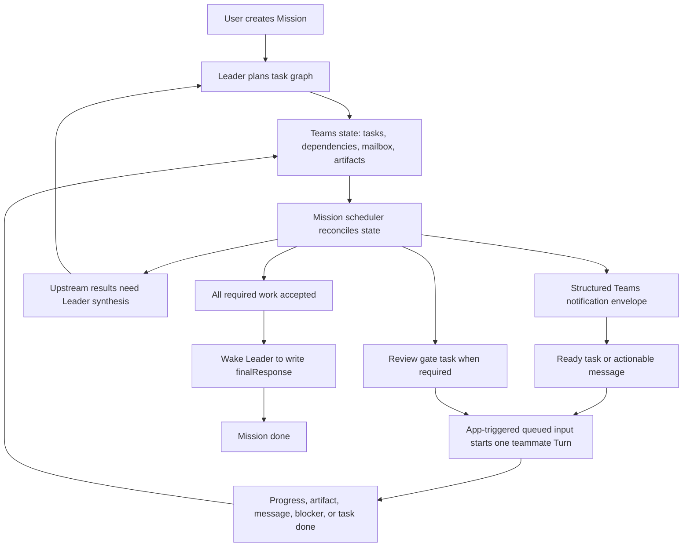

# DotCraft Agent Teams Specification

| Field | Value |
|-------|-------|
| **Related Specs** | [Prompt Composition](../agents/prompt-composition.md), [Agent Profiles](agent-profiles.md), [App Binding](../protocols/app-binding.md), [Session Core](../architecture/session-core.md), [AppServer Protocol](../protocols/appserver-protocol.md), [Desktop Client](../clients/desktop-client.md), [SDK](../sdk/sdk.md) |

Purpose: define Agent Teams as an App Binding validation scenario and first-party managed app runtime without making teams a DotCraft Core entity.

Agent Teams ships a DotCraft Team experience behind the installable built-in `agent-teams` plugin. Once the plugin is installed and enabled for a workspace, Desktop exposes one persistent team containing DotCraft robot teammates. Users create Missions; the Team Leader agent breaks work into a Teams-owned task board, teammates collaborate through structured Teams events, and a mission scheduler dispatches ordinary queued inputs to mission-scoped teammate threads only when work is ready to run.

Teams keeps the state model rich enough for scheduling and Desktop diagnosis, but makes the model-visible tools intentionally small. Mission id, current task id, sender identity, default artifact metadata, and passive/actionable routing are derived from the mission thread context and Teams state wherever possible. Model-visible task and artifact references use Mission-scoped aliases such as `t1` and `a1` first, while canonical ids remain stored for compatibility.

---

## 1. Scope

This specification defines:

- A first-party `DotCraft.Teams` module that behaves like an App Binding app while running in-process.
- The built-in `agent-teams` plugin as the user-visible product gate and Desktop extension for the Team panel.
- The Desktop Team panel as the primary user entry point after the plugin is installed and enabled.
- A workspace-scoped `TeamRecord` with default members, missions, tasks, lightweight team messages, mailbox digests, and artifact references.
- Mission teammate threads as ordinary top-level DotCraft threads with independent App Bindings, scopes, tools, audit, and mission-bound context blocks.
- Teams-owned task graph, dependency, mailbox, review-gate, scheduler, and final-response state.
- A Mission-shell + Task-board model: `Mission` is the user-facing delivery and archival unit, while `TeamTask` records form a mission-scoped shared task board with owner/status/dependency/metadata semantics.
- A rich-state / lean-tool contract: Teams records keep scheduler-facing metadata, but agents operate through small context-inferred tool calls.
- Mission-scoped scratchpad/artifact workspace paths for durable cross-teammate handoff material.
- Structured Teams notification envelopes used by the scheduler when turning state changes into queued inputs.
- Split queued-input rendering: structured `materializedInputParts` for the model and clean `nativeInputParts` / `displayText` for Desktop.
- Mission-scoped short aliases for task and artifact references.
- The `app/threadInput/enqueue` App Binding RPC so a bound app can enqueue input for its own bound thread.
- `runWhenIdle` queued-input start policy: the app may request automatic start only when the target thread is idle.
- Binding-scoped App Context Blocks for fixed role, mission, and app policy context.
- Teams-owned role instructions for Mission teammate identity and collaboration boundaries.

Out of scope:

- Core `TeamRun`, `TeamSession`, `Member`, `Task`, `Mailbox`, or `Artifact` entities.
- Binding inheritance or delegation to SubAgents.
- Model-visible dynamic Team or member creation. DotCraft Teams uses a fixed roster; per-role customization belongs on Agent Profiles as skills, MCP servers, plugins, prompts, permission policy, and tool-surface settings.
- Generic `TaskCreate`, `TaskUpdate`, `TaskList`, or `TaskGet` tool aliases. Teams uses the dedicated tool names below to keep the model-visible tool surface small.
- Global scheduler ownership in Core.
- Raw mailbox events as thread history.
- App authority to edit full base instructions or the generated base prompt.

---

## 2. Architecture Boundary

Agent Teams is a managed App Binding runtime, not a Core special case.

The runtime is registered by the first-party `DotCraft.Teams` module, but product visibility and user enablement are plugin-owned:

- Desktop exposes the Team sidebar entry only when the `agent-teams` plugin is installed and enabled.
- Team RPCs reject direct calls when the `agent-teams` plugin is absent or disabled.
- The plugin contributes interface metadata and a Desktop extension descriptor; it does not contribute skills, MCP, LSP, or external App Binding descriptors.
- Desktop derives the Team sidebar entry and plugin-detail included content from the plugin's Desktop extension descriptor. Teams must not rely on Desktop hardcoding the `agent-teams` plugin id to create these surfaces.
- Installing or enabling the plugin does not delete or migrate existing Team state. Disabling it hides the entry point and blocks new Team operations.

DotCraft Core owns:

- Thread, Turn, Item, queued input, approvals, persistence, and event streams.
- App Binding connection, binding, scope, grant, context-block, and audit records.
- Validation that app-triggered queued input targets only a thread bound to the calling app.
- Runtime Dynamic Tool exposure for app-bound tools.
- Prompt inclusion and lifecycle filtering for App Context Blocks.

`DotCraft.Teams` owns:

- `TeamRecord`, `TeamMember`, `Mission`, `MissionThread`, `Task`, `MailboxDigest`, and `ArtifactRef` state.
- Mission scratchpad and artifact workspace paths under Teams-owned workspace storage.
- Lightweight mission-scoped `TeamMessage` state.
- Member roster and role profiles.
- Mission planning, task-board assignment, dependency resolution, progress reporting, review gates, final responses, task metadata, task output summaries, and artifact references.
- Message/digest policy.
- The mission scheduler that reconciles Teams state changes and decides when to enqueue app-triggered input.
- First-party app descriptor, tool specs, and tool handlers.

Teams state is persisted under:

```text
.craft/teams/state.json
```

Teams must create or reserve one mission scratchpad/artifact workspace path per Mission under Teams-owned storage, such as:

```text
.craft/teams/missions/{missionId}/
```

Scratchpad files are durable handoff material, not authoritative scheduler state. Mission, Task, Message, and Artifact records remain the source of truth for scheduling and finalization.

Tasks and artifacts have two identifiers:

- Canonical ids such as `task_...` and `artifact_...` remain persisted, globally safe, and backward-compatible.
- Mission-scoped aliases such as `t1`, `t2`, `a1`, and `a2` are the preferred model-visible references in prompts, tool results, and state summaries.

Agents should use short aliases in ordinary tool parameters and prose handoffs. Teams resolves aliases inside the current Mission and stores canonical ids internally. Canonical ids may still appear for compatibility and debugging, but prompts should be alias-first to reduce token cost and copy errors.

The state root uses `team` for workspace-level metadata and `teamId` for the default team identity.

Core persists only App Binding and Session Core state. It must not interpret Teams task or mailbox data as native Core state.

---

## 3. Product Experience

Desktop exposes a `Team` sidebar entry only after the `agent-teams` plugin is installed and enabled from the Plugins catalog.

The main Teams screen is a DotCraft Team card board:

- A lightweight card-game collaboration table with DotCraft robot teammate cards, Mission cards, Task cards, and live status.
- A right-side card-detail rail for the selected teammate, mission, or task.
- A primary Mission Draft workflow inside the card board.
- Thread links that open the real mission teammate thread when a selected Mission or Task supplies enough context.
- Status derived from Teams state, `thread/queue/updated`, `thread/runtimeChanged`, and `turn/*` notifications.

The visual direction is a DotCraft card-game collaboration space, not a literal office. The board may feel playful and tactile, but must avoid desks, station platforms, office furniture, fixed bases, and heavy sci-fi control panels.

The default roster:

| Member | Role |
|--------|------|
| Team Leader | Breaks down missions, assigns work, coordinates the team. |
| Explorer | Researches, inspects, and maps unknowns. |
| Builder | Implements changes and creates artifacts. |
| Reviewer | Checks risks, quality, and correctness. |
| Operator | Handles app/computer-oriented operational tasks. |

Each active Mission uses ordinary top-level DotCraft threads for the teammates that participate in that Mission. A Mission always creates and starts a Leader mission thread when the Mission is created. Other teammate Mission threads are created lazily when the Leader first assigns work to that teammate for the Mission. A teammate can have many historical Mission threads, but Teams schedules them globally so the same teammate has at most one running/waiting Mission thread at a time. Desktop must include active Teams Mission threads in ordinary conversation discovery while the `agent-teams` plugin is installed and enabled, so users can open the real Leader and teammate threads from the global thread list. Desktop must not render raw Teams mailbox events as canonical conversation history.

---

## 4. Workflow

The required collaboration loop is:

1. The user installs and enables the `agent-teams` plugin for a workspace.
2. Teams creates or repairs the default member roster without creating long-lived member work threads; repair also refreshes non-archived Mission teammate thread role instructions.
3. The user creates a Mission.
4. Teams creates one Leader Mission thread for that Mission.
5. Teams creates one managed App Binding for the Leader Mission thread.
6. Teams applies Teams-owned role instructions and upserts fixed role, mission, and policy context blocks for that Mission thread.
7. Teams enqueues a Leader Mission input with `triggerKind = "team"` and `startPolicy = "runWhenIdle"`.
8. The Leader agent runs as a normal DotCraft turn and calls Teams tools.
9. `AssignTask` creates Teams-owned task/digest state, records task dependencies, and lazily creates the target teammate's Mission thread when needed.
10. The Teams mission scheduler reconciles the task graph; it enqueues input only for ready tasks whose assignee can safely run.
11. Member agents run ordinary turns and report progress, artifacts, task completion, blockers, and mailbox messages through Teams tools.
12. Every Teams state change and relevant thread runtime signal triggers scheduler reconciliation.
13. The scheduler converts relevant Teams state changes into structured internal notification envelopes, then unblocks dependent tasks, starts ready tasks, coalesces actionable mailbox messages, dispatches review-gate tasks, or wakes the Leader for synthesis and finalization.
14. When a dependency-gated task is marked as requiring Leader synthesis, the scheduler wakes the Leader after upstream dependencies complete and holds teammate dispatch until that synthesis is supplied.
15. The Leader inspects teammate progress through explicit Team tools, decides the user-facing outcome, records `finalResponse`, and completes the Mission.
16. Teams updates digests, Mission thread state, and Desktop notifications as state changes.

If the same teammate already has a running, waiting-approval, or waiting-input Mission thread, Teams leaves the new Mission thread input queued. It must not interrupt or preempt the active turn.

### 4.1 Mission Shell And Task Board

Agent Teams intentionally keeps DotCraft's Mission shell instead of reducing Team state to a generic task list.

The three layers are:

| Layer | Owner | Purpose |
|-------|-------|---------|
| Mission | `DotCraft.Teams` | User request, Leader final response, archival, Desktop visualization, and user-facing completion state. |
| TeamTask | `DotCraft.Teams` | Mission-scoped shared task board with assignee, status, dependencies, blockers, latest update, output summary, and JSON metadata. |
| Scheduler | `DotCraft.Teams` | The only component that turns Teams state into queued input for Mission teammate threads. |

Task-list primitives are useful inside a collaborative board, but DotCraft must not collapse Mission into Task. Mission remains the stable product unit for Desktop cards, history, final response display, and user cancellation/archive operations. TeamTask records may evolve toward richer task-board semantics, but they remain scoped under a Mission and do not replace Mission lifecycle or Leader finalization.

The default Team roster is fixed. The Leader assigns work to configured roles rather than dynamically creating teammates. Per-role customization is expressed by attaching role profile settings to member records: Skills, MCP servers, plugins, role prompt, permission mode, and model-visible tool surface. Dynamic `TeamCreate`, `TeamDelete`, and member spawn tools are out of scope.

### 4.2 Collaboration Loop

Team collaboration is event-driven. Teammate messages, progress updates, artifacts, task completion, thread-idle signals, and review decisions are Teams events. They are not themselves DotCraft Turns. Only the mission scheduler may convert Teams events into app-triggered queued input.



Required scheduler behavior:

- `SendMessage` writes an actionable mission-scoped mailbox event and updates mailbox digests. It does not directly enqueue the recipient thread.
- Passive context should be recorded as progress, artifacts, task output summaries, or state read results rather than through `SendMessage`.
- Mailbox events may wake a recipient only after scheduler reconciliation confirms the recipient has work it can perform now.
- Scheduler wakeups are coalesced by target thread and mission so several events can be delivered as one queued input.
- Dependency satisfaction, task blockers, review gate outcomes, mission cancellation, and thread runtime completion all trigger reconciliation.
- Scheduler-generated queued input must use a structured Teams notification envelope rather than plain teammate prose for model input. The envelope should identify mission id, task alias/canonical id when present, source member, target member, event kind, status, summary, artifact aliases/canonical ids, and whether action is required. UI display input must use a clean tag-free summary.
- Structured Teams notifications are internal workflow signals. Agents must treat them as Teams runtime events, not as user-authored chat messages.
- When a dependency-gated task has `requiresLeaderSynthesis`, the scheduler wakes the Leader after dependencies are satisfied and does not start the assignee until Leader synthesis is supplied by an actionable task-scoped message or an equivalent Teams state update.
- When a teammate marks a task done before the Mission is ready for finalization, the scheduler wakes the Leader with a task-result continuation so the Leader can decide whether to assign follow-up work, send a handoff, or simply end the turn and wait for the next event.
- If a teammate Turn ends while its current task is still `running`, the scheduler sends at most one completion-recovery input to the same teammate before marking the task `blocked` and waking the Leader.
- The scheduler is owned by `DotCraft.Teams`; Core only provides queued input, thread runtime state, and notification substrate.

### 4.3 Mission Lifecycle

Teams owns the authoritative Mission lifecycle. Desktop clients must render Mission cards from Teams state rather than deriving completion from local UI state.

Mission statuses:

| Status | Meaning |
|--------|---------|
| `planning` | Mission has been created and the Leader input has been enqueued or is running. |
| `active` | The Leader has recorded a plan and/or dispatched at least one task. |
| `awaitingLeaderReview` | All required tasks and review gates are complete, and the Leader must produce the final user-facing response. |
| `done` | The Leader has finalized the Mission with `finalResponse`. |
| `cancelled` | The user cancelled the Mission. Non-done tasks under it are cancelled. |

Mission archival is not a status. An archived Mission keeps its terminal status and records `archivedAt`. `teams/team/view` hides archived Missions from the default `missions` list and hides their Tasks/Artifacts/MissionThreads from the active board by default. The same view may expose a read-only `archivedMissions` list so Desktop can render the history card pile without restoring those Missions into the active tabletop. Archiving does not delete state.

Completion rules:

- `CreateMissionPlan` moves a `planning` Mission to `active`.
- `AssignTask` moves a `planning` Mission to `active` if it has not already moved.
- `MarkTaskDone` completes only the owning Task. It never completes the Mission directly.
- When every required Task is `done` and every required review gate is accepted, scheduler reconciliation moves the Mission to `awaitingLeaderReview` and wakes the Leader.
- `MarkMissionDone` lets the Leader mark a Mission `done` only when `finalResponse` is supplied and either no Tasks were dispatched or the Mission is already ready for Leader finalization.
- Leader waiting is not a model-visible tool. After dispatching work or sending a message, the Leader ends the turn; scheduler reconciliation later wakes the Leader through normal app-triggered queued input when task results, blockers, teammate messages, synthesis needs, or final review require Leader attention.
- Attempts to mark a Mission `done` while required Tasks, blockers, or review gates remain unresolved must return an actionable error naming the unfinished work.
- Only terminal Missions (`done` or `cancelled`) can be archived.
- Cancelling a Mission cancels running turns and removes queued inputs on that Mission's teammate threads, but keeps those threads available for inspection.
- Desktop expresses user cancellation and archival as card actions: an active Mission card must be dragged into the discard pile and confirmed to cancel; a terminal Mission card may be dragged into the same pile to archive. The discard pile is not a clickable cancel or archive button.
- Archiving a terminal Mission also archives its Mission teammate threads. Archived Mission threads are hidden from the default Team view with the archived Mission.

### 4.4 Task Board, Dependencies, And Review Gates

Tasks are durable Teams state, not prompt-only instructions. Within a Mission, they behave like a shared task board: every TeamTask has one assignee, a scheduler-visible status, dependency/blocker fields, optional JSON metadata, a latest update, and an output summary. Dependencies that affect scheduling must be represented in task fields rather than only described in natural language.

Task prompts are also part of the scheduling contract. A teammate Mission thread may not have seen the Leader's prior conversation or another teammate's transcript, so each queued task input must be self-contained enough for the assignee to act. It may reference upstream task aliases, artifact aliases, and scratchpad paths, but it must not rely only on vague language such as "use the research results" when the scheduler needs the assignee to perform concrete work.

Task statuses:

| Status | Meaning |
|--------|---------|
| `pending` | Task has been created and is waiting for scheduler evaluation. |
| `waitingDependencies` | Task is blocked by unresolved `dependsOnTaskIds` or `blockedOnTaskIds`. |
| `ready` | Task can run, but the assignee or thread is not ready to receive input yet. |
| `running` | Task has been queued or is currently running in the assignee's Mission thread. |
| `blocked` | Assignee reported a blocker that requires another task, Leader decision, user input, or external condition. |
| `review` | Task work is complete, but a required review gate has not accepted it yet. |
| `done` | Task is complete and accepted for Mission finalization. |
| `failed` | Task cannot continue without Mission-level recovery. |
| `cancelled` | Task was cancelled with its Mission or by an explicit Teams decision. |

Task records must support:

- `dependsOnTaskIds` for explicit upstream dependencies chosen by the Leader.
- `blockedOnTaskIds` and `blockedReason` for blockers discovered during execution.
- `requiredForMission` so optional helper tasks do not block finalization.
- `kind` so ordinary work, handoff, and review tasks can be distinguished without hardcoding member roles.
- `requiresLeaderSynthesis` and synthesis-delivery bookkeeping for dependency-gated tasks that must return to the Leader before teammate dispatch.
- `latestUpdate` for the most recent progress or completion update that should be visible in Team tools and Leader continuation inputs.
- `outputSummary` for the assignee's reusable result summary. This is not an artifact and does not complete a Task by itself.
- `metadata` for JSON-friendly, role-specific extension data. Metadata must be additive state, not scheduler policy.
- Artifact references and mailbox digest references needed for downstream tasks.
- Completion-recovery bookkeeping so one incomplete teammate turn can be followed by one targeted recovery turn without infinite retries.

Downstream task rules:

- If the Leader can express a downstream task concretely before the upstream work runs, the Leader may create it early with `dependsOnTaskIds`.
- If the downstream task requires interpretation of upstream output, the Leader should either wait to create it until upstream completion or create it with `requiresLeaderSynthesis` so the scheduler returns to the Leader before dispatch.
- Scheduler may attach upstream summaries, artifact aliases, and scratchpad paths to a ready task input, but it must not fabricate missing Leader synthesis.
- A task with `requiresLeaderSynthesis` becomes dispatchable only after dependencies are satisfied and the Leader supplies actionable synthesized instructions for that task, usually with `SendMessage` scoped to the task.
- Review tasks must use `kind = "review"` and depend on the task or artifact they review whenever required work already exists.

Completion recovery:

- A teammate turn that produces ordinary prose, tool output, or artifacts but leaves its task `running` is incomplete from the Teams scheduler's point of view.
- On the first incomplete turn for a task, scheduler reconciliation must enqueue a short recovery input to the same teammate. The recovery input asks the teammate to choose exactly one outcome: publish any reusable artifact and call `MarkTaskDone`, call `MarkTaskDone` directly, or call `ReportProgress(status: "blocked")` with an actionable summary.
- If the recovery turn also ends without one of those Teams state updates, the task becomes `blocked` and the Leader is woken once for coordination.
- Teams must not automatically convert ordinary assistant text into artifact publication or task completion.

Review is a task or gate property, not a hardcoded `Reviewer` member rule. The default `Reviewer` teammate is a convenient assignee for review work, but any task may bind its review gate to the member or task owner selected by the Leader. A rejected review must create or unblock actionable revision work rather than silently keeping the Mission active.

### 4.5 Artifact References

Artifacts are explicit Teams records, not inferred from ordinary assistant text and not automatically created when a Task is marked done. `PublishArtifact` records durable handoff material that Desktop and Team tools can display without reading raw teammate transcripts.

Artifact records must keep the legacy `title`, `uri`/`path`, and `description` shape while also supporting:

- `kind` for the artifact category, such as `reference`, `document`, `patch`, `dataset`, `report`, or `note`.
- `format` for MIME type, extension, or app-specific format.
- `summary` for a short reusable description.
- `sourceTaskId` and optional `sourceMessageId` for tracing the artifact back to the task/message that produced or referenced it.
- `metadata` for JSON-friendly, artifact-specific extension data.

Artifact publication never completes a task. A teammate that produces an artifact must still call `MarkTaskDone` or `ReportProgress(status: "blocked")` before ending the turn. The model-visible `PublishArtifact` tool accepts only the artifact title, one path-or-URI value, an optional summary, and an optional task override when the caller is allowed to publish for that task. Artifact kind, format, source task, and legacy description fields are derived by Teams.

### 4.6 Mailbox Semantics

Teammate-to-teammate communication uses mission-scoped mailbox events. A mailbox event is Teams state and digest input, not a DotCraft `UserMessagePayload` and not canonical thread history.

Mailbox events must capture:

- Sender and recipient member/thread identity.
- Mission id and optional task id.
- Message kind such as `info`, `request`, `handoff`, `revision`, `decision`, `blocker`, or `synthesis`.
- Short summary, optional structured detail, and artifact references.
- Internal `requiresAction` state so the scheduler can distinguish passive system events from work that may wake the recipient. The model-visible `SendMessage` tool always creates an actionable event.
- Bookkeeping status such as `recorded`, `summarized`, `deliveredToTurn`, or `superseded`; this is scheduler/digest state, not a user-facing read receipt.

Messages should usually point at task or artifact state instead of carrying long-form content. When several messages target the same member while it is idle or busy, the scheduler should prefer one coalesced queued input with a mailbox summary over several small turns.

Message routing priorities:

- Leader messages and Leader-generated task assignments represent user intent and coordination; they should be delivered before peer-to-peer chatter when both are actionable.
- Peer-to-peer messages are allowed for handoff, review feedback, and concrete requests, but they must not replace task dependencies. If a message establishes scheduling order, the corresponding task dependency or blocker field must also be updated.
- Broadcast-style messages are expensive and should be reserved for information every participating member truly needs.

When mailbox events are delivered to a teammate turn, the model-visible queued input must identify them as internal Teams notifications. The model-visible text may use XML-style or similarly parseable envelopes, but UI display text must not expose those raw runtime tags. It must make clear that normal prose replies are not delivered to teammates unless `SendMessage` is called.

Model-visible messages should stay short. If a message needs to refer to artifacts, the sender should mention existing artifact aliases such as `a1` or canonical ids such as `artifact_...` in the text; Teams validates and links those ids automatically. Unknown artifact-looking ids and unknown artifact aliases must be rejected so agents do not create dangling handoff references.

### 4.7 Prompt And Event Injection Contract

Agent Teams uses several prompt surfaces. Each surface has a narrow purpose so runtime state does not drift into high-priority prompts and prompts do not compensate for missing tools.

| Surface | Lifecycle | Injection point | Contract |
|---------|-----------|-----------------|----------|
| Role instructions | Mission thread lifecycle | Role-instruction layer | Stable role identity, collaboration boundary, and hard workflow rules. |
| App context blocks | Mission thread lifecycle; repaired on Teams state repair | App Binding context | Stable mission id/title/prompt/status, member role, policy notes, and scratchpad path. |
| Queued input | One turn | Scheduler-generated input | Current event, task assignment, mailbox summary, recovery check, blocker handling, or finalization request. |
| Tool descriptions/schema | Tool catalog lifecycle | Model-visible tool list | Tool selection hints and parameter semantics only. |

Prompt rules:

- Role instructions define the member's team role and the turn-exit contract, but they must not contain live task lists, mailbox digests, or teammate status.
- App context blocks contain fixed role, mission, policy, and scratchpad context. They are not a communication channel and must not be used for live progress updates.
- Queued inputs carry dynamic event data. They should be concise, structured, and specific to the action currently required.
- Tool descriptions should remain stable where possible for prompt cache health. Dynamic mission state belongs in queued input or read tools, not in tool descriptions.
- Teammate task and mailbox inputs must remind the assignee that ordinary chat output is not task completion. Before ending a turn that works on an assigned task, the teammate must call `MarkTaskDone` or `ReportProgress(status: "blocked")`; `PublishArtifact` is used when there is a reusable result.
- Recovery inputs must be short and corrective. They should not restate the full mission; they should ask the teammate to finish the missing Teams state update using the context already present in the thread.
- Leader blocker/finalization inputs must identify themselves as internal Teams runtime events, not user-authored messages.

Each scheduler queued input has two representations:

- `materializedInputParts` are for the model. They may contain the structured Teams runtime envelope, including `<team-notification ...>` tags.
- `nativeInputParts` and `displayText` are for Desktop/user display. They must be short, human-readable summaries and must not contain raw Teams runtime envelope tags.

Teams keeps `triggerKind = team`, `triggerLabel`, and `triggerRefId` for both representations so Desktop can show source pills such as "Sent by Teams" while rendering clean display text.

Leader synthesis rules:

- The Leader is responsible for reading upstream task results and turning them into specific downstream instructions.
- The Leader must not delegate understanding by assigning vague downstream work that only says to use another teammate's findings.
- When continuing an existing teammate thread, the Leader may assume that teammate has its own mission-thread context. When assigning a fresh teammate task, the task input must include the relevant mission goal, scope, upstream artifacts, and done criteria.
- Verification and review tasks should be framed as independent checks, not as requests to agree with the Builder.

---

## 5. App Context Blocks

App Context Blocks are binding-scoped, persisted in App Binding state, and rendered by DotCraft's context framework into a fixed `App Context` system prompt section. Model-visible block content is wrapped in the shared `<app-context>` tag.

Required fields:

| Field | Type | Required |
|-------|------|----------|
| `blockId` | string | yes |
| `threadId` | string | derived |
| `bindingId` | string | yes |
| `appId` | string | yes |
| `kind` | `role \| mission \| policy` | yes |
| `title` | string | yes |
| `content` | string | yes |
| `order` | number | yes |
| `version` | string | yes |
| `updatedAt` | timestamp | derived |
| `expiresAt` | timestamp | no |
| `visibility` | `model \| hiddenFromModel` | no |

Rules:

- Apps may upsert or remove blocks only for their own active binding.
- The target `threadId` is derived from `bindingId`; callers cannot choose an arbitrary thread.
- Mission teammate threads must include a Mission context block containing the current Mission id, title, prompt, and Teams-owned scratchpad/artifact workspace path.
- Context block changes do not create Turns, Items, or thread rollout records.
- Removed, expired, revoked, offline, or hidden blocks are excluded from prompts.
- Updating blocks must invalidate the target thread's app-context prompt page.
- Context block content is app-provided context, not higher-priority system instruction.
- Teams App Context is not a member communication channel. Teams must not inject live teammate progress, mailbox digests, or directed messages into context blocks; agents must use Team tools to inspect dynamic collaboration state.
- App Context Block prompt rendering must not embed mutable metadata fields such as `version`, `updatedAt`, or `expiresAt`; those fields remain available through `thread/appContextBlocks/list` and App Binding audit only.
- Scratchpad paths in App Context identify durable handoff storage only. They do not grant authority to treat scratchpad files as completed Tasks, accepted reviews, or final Mission state.

Mission teammate threads may additionally set role instructions. These role instructions are deterministic Teams-owned system guidance appended after the base prompt. They define the member's Team role, clarify that teammate threads collaborate inside the Mission rather than directly chatting with the end user, and direct live coordination through Team tools. Teams must not use full-prompt replacement.

---

## 6. App-Triggered Queued Input

App-triggered queued input uses `app/threadInput/enqueue`.

**Direction**: app -> server

Params:

| Field | Type | Required | Description |
|-------|------|----------|-------------|
| `bindingId` | string | yes | App Binding that owns the target thread. |
| `appId` | string | yes | Calling app id. |
| `grantId` | string | yes | Grant id accepted for the binding. |
| `input` | `InputPart[]` | yes | Input to enqueue. Teams currently sends text input. |
| `displayText` | string | no | UI preview text. |
| `triggerLabel` | string | no | Human-readable source label. |
| `triggerRefId` | string | no | App-owned source id, such as a mission or task id. |
| `startPolicy` | `queueOnly \| runWhenIdle` | no | Default is `queueOnly`. |

Result:

```json
{
  "queuedInput": { "id": "queue_...", "triggerKind": "team" },
  "queuedInputs": []
}
```

Validation:

- `bindingId` must exist.
- `appId` and `grantId` must match the binding.
- The binding must be active, unexpired, and connected or managed.
- The binding must not be revoked, cancelled, pending, offline, or expired.
- The target thread is derived from the binding and must exist.
- Cross-app and cross-thread enqueue attempts are rejected.
- Enqueued input must preserve `triggerKind`, `triggerLabel`, and `triggerRefId`.
- The future `UserMessagePayload` created after dequeue must preserve the trigger metadata.
- The operation records App Binding audit.

For the first-party Teams app, `triggerKind` is `team`. Other App Binding apps use `app`.

Teams should call `app/threadInput/enqueue` as the scheduler's dispatch mechanism. Individual Teams tools such as `AssignTask`, `SendMessage`, `ReportProgress`, `PublishArtifact`, and `MarkTaskDone` update Teams state and trigger scheduler reconciliation; they must not each independently decide to enqueue thread input.

Teams queued inputs must preserve a split between model and display surfaces:

- `materializedInputParts`: structured Teams event payload for the model.
- `nativeInputParts`: clean display payload for Desktop rendering.
- `displayText`: the same clean summary used by UI previews.

This lets the model keep a parseable runtime envelope while preventing UI cards from rendering implementation tags such as `<team-notification>`.

---

## 7. Managed App Binding Runtime

First-party modules may register managed App Binding runtimes.

A managed runtime contributes:

- An `AppDescriptor`.
- App-bound `DynamicToolSpec` entries.
- In-process tool handlers.

Managed runtimes use the same App Binding records, scopes, tools, context blocks, prompt rendering, and audit as external apps. They do not use external stdio/WebSocket tool transport, and they are not marked offline merely because no external attachment exists.

This is a substrate convenience for first-party apps. The external contracts must keep the external app shape so Teams can later become a separate native app without changing the thread model.

Managed runtime descriptors are not product App catalog entries on their own. `DotCraft.Teams` is owned by the `agent-teams` Desktop Extension plugin and may appear only on `welcome` and `threadBinding` App Binding surfaces after that plugin is installed and enabled. It must never appear on `pluginDetail`, and DotCraft must not expose it by creating a synthetic installed plugin.

Ordinary threads get only an explicit Team entrypoint, and completed Mission output is delivered back to the origin thread as a structured runtime notification. DotCraft keeps the Mission shell, Leader/teammate Mission threads, and role-specific managed bindings as first-party product boundaries.

---

## 8. Teams Runtime

`DotCraft.Teams` registers:

```text
appId: com.dotharness.dotcraft-teams
toolNamespace: teams
```

Required RPCs:

| Method | Description |
|--------|-------------|
| `teams/team/view` | Returns the current team, members, active missions, archived mission summaries, task graph, mailbox digests, review status, final responses, artifacts, and thread runtime hints. |
| `teams/team/enable` | Internal Desktop repair/ensure RPC. Creates or repairs the workspace team roster after the `agent-teams` plugin is installed and enabled. It is not a user-visible enablement flow. |
| `teams/mission/create` | Creates a mission and enqueues the Leader input. |
| `teams/mission/cancel` | Cancels a Teams-owned mission. |
| `teams/mission/archive` | Archives a terminal Teams-owned mission without deleting its state. |
| `teams/member/openThread` | Returns the real Mission teammate `threadId` for Desktop navigation. Callers must provide `taskId` or `missionId` + `memberId`; Teams must not guess from only `memberId`. |

Required notifications:

```text
teams/team/changed
```

Required tools:

| Tool | Role |
|------|------|
| `CreateMissionPlan` | Leader records a plan for a mission. |
| `AssignTask` | Leader creates a Mission-scoped task-board item, records dependencies/review requirements, and lets the scheduler dispatch it when ready. |
| `ListTeamMembers` | Any member reads roster, roles, and teammate availability summaries. |
| `ReadMissionState` | Any member reads mission-scoped task graph, thread, digest, artifact, review, and mailbox summaries. |
| `ReadMemberStatus` | Any member reads one teammate's current mission/task status and recent progress. |
| `SendMessage` | Any participating member sends a lightweight mission-scoped mailbox event to the Leader or another participating teammate. |
| `ReportProgress` | Any member records running progress or blockers and updates digest/latest-update state. |
| `PublishArtifact` | Any member records an explicit app-owned artifact reference. |
| `MarkTaskDone` | Any member marks its assigned Teams task complete, records final output summary, and triggers scheduler reconciliation. |
| `MarkMissionDone` | Leader finalizes a Teams mission with `finalResponse`. |

Ordinary user threads receive a separate managed tool surface only when the user explicitly enables Agent Teams for that thread. V1 exposes one tool:

| Tool | Surface | Description |
|------|---------|-------------|
| `CreateTeam` | ordinary thread | Creates a Mission from `title` and `prompt`, starts the Leader Mission thread, enqueues the Leader input, and returns a startup summary. |

`CreateTeam` is asynchronous from the origin thread's point of view. It returns `missionId`, `title`, `leaderThreadId`, `queuedInputId`, and `status`; it must not wait for the Mission's final answer. It must not expose internal collaboration tools such as `AssignTask`, `MarkTaskDone`, or `MarkMissionDone` to the ordinary thread.

When the Leader later calls `MarkMissionDone(finalResponse)`, Teams records the final response on the Mission. If the Mission was created through `CreateTeam`, Teams then enqueues exactly one `team`-triggered structured notification back to the origin thread. The notification includes Mission id, status, `finalResponse`, and task/artifact summaries. If the origin thread no longer exists or cannot accept queued input, Mission completion still succeeds and the final response remains available in Teams state/Desktop.

Teams tool exposure is role-specific. First-party managed Teams workflow tools are high-frequency state-control tools and should be directly visible to the model for the roles that can use them. This exception applies only to the managed `DotCraft.Teams` runtime; it must not weaken the default App Binding policy that external mutable app tools may be deferred.

| Role surface | Direct Teams tools |
|--------------|--------------------|
| Ordinary thread | `CreateTeam` |
| Leader | `CreateMissionPlan`, `AssignTask`, `ListTeamMembers`, `ReadMissionState`, `ReadMemberStatus`, `SendMessage`, `MarkMissionDone` |
| Teammate | `ListTeamMembers`, `ReadMissionState`, `ReadMemberStatus`, `SendMessage`, `ReportProgress`, `PublishArtifact`, `MarkTaskDone` |

Tools outside the caller's role surface should not be advertised for that Mission thread. Runtime validation remains authoritative even if a tool is somehow called outside its role surface:

- Leader cannot complete teammate-owned Tasks with `MarkTaskDone`.
- Teammates cannot call `CreateMissionPlan`, `AssignTask`, or `MarkMissionDone`.
- `ReportProgress`, `PublishArtifact`, and `MarkTaskDone` remain assignee-thread scoped.
- `MarkMissionDone` remains Leader-thread scoped.

Tool calls update Teams state and must not write raw mailbox or message events into DotCraft thread history. `SendMessage` records a lightweight `TeamMessage`, updates mailbox digests, and triggers scheduler reconciliation; it does not directly enqueue the target Mission teammate thread, create a full inbox/read-ack protocol, or create a canonical conversation turn. `ReportProgress`, `PublishArtifact`, and `MarkTaskDone` must reject calls unless the calling thread is the assignee's Mission thread for the target Task.

Model-visible tool schemas are:

| Tool | Model-visible arguments |
|------|-------------------------|
| `CreateMissionPlan` | `plan` |
| `AssignTask` | `assignee`, `title`, `prompt`, optional `dependsOnTaskIds`, optional `kind`, optional `requiresLeaderSynthesis` |
| `ListTeamMembers` | none |
| `ReadMissionState` | none |
| `ReadMemberStatus` | `memberId` |
| `SendMessage` | `to`, `message`, optional `taskId` |
| `ReportProgress` | `summary`, optional `status`, optional `blockedOnTaskIds` |
| `PublishArtifact` | `title`, `pathOrUri`, optional `summary`, optional `taskId` |
| `MarkTaskDone` | `summary` |
| `MarkMissionDone` | `finalResponse` |
| `CreateTeam` | `title`, `prompt` |

The runtime derives `missionId` from the calling Mission thread. Teammate task tools derive the current task from the calling Mission thread unless an explicit optional `taskId` is supported and passes assignee validation. Sender member id is derived from the calling Mission thread. Agents should not be asked to copy mission ids, sender ids, metadata objects, artifact kinds, or source-message ids into ordinary workflow tool calls.

For model-visible task references, Teams accepts either a Mission-scoped alias such as `t1` or a canonical id such as `task_...`. This applies to `dependsOnTaskIds`, `blockedOnTaskIds`, and optional `taskId`. Tool results and `ReadMissionState` should show `alias` next to canonical ids, with the alias first.

`AssignTask` must accept explicit dependency fields and may mark a dependency-gated task as requiring Leader synthesis before dispatch. If dependencies are unresolved, the Task enters `waitingDependencies` and no teammate input is enqueued until scheduler reconciliation moves it to `ready` or wakes the Leader for required synthesis. `requiredForMission` is not model-visible; Leader-created tasks are required for Mission finalization by default. Optional helper work is represented through a dedicated policy or internal state update, not by adding broad parameters to the primary tool.

`AssignTask` task briefs must include enough context for the assigned teammate to act without reading the Leader's conversation. If a task depends on upstream work, dependencies must be represented with `dependsOnTaskIds`, and the brief should reference concrete upstream task aliases, artifact aliases, or scratchpad paths rather than only prose handoff.

There is no model-visible wait tool. Waiting is represented by ending the current Leader turn after writing state. The scheduler wakes the Leader when task results, blockers, teammate messages, synthesis needs, or final review require attention. Leader instructions must explicitly forbid polling loops and explain that `SendMessage` plus scheduler wakeups are the coordination path.

`SendMessage` always creates an actionable mailbox event. Its `kind` is inferred by Teams: a Leader task-scoped message to the assignee of a task waiting on Leader synthesis is recorded as `synthesis`; other model-visible messages default to `request`. The `to` argument resolves member id, role, display name, or `leader`. Artifact aliases such as `a1` and canonical artifact ids mentioned in message text are validated and linked automatically.

`ReportProgress` may record `running` progress or a `blocked` state with an actionable summary. It is not a completion signal; a model response such as `completed` must not mark a Task done. Tasks are completed only by `MarkTaskDone` or by Mission cancellation.

`PublishArtifact` records explicit artifacts only. It accepts one `pathOrUri` argument. Teams infers artifact kind and format from the URI/path and writes legacy `description` from `summary` when useful. It must not automatically complete a Task or convert ordinary assistant prose into an artifact.

`MarkTaskDone` records the completion summary as the Task digest, latest update, and output summary, but it must not automatically create artifacts. Reusable files, links, or structured deliverables must be published with `PublishArtifact`.

`MarkMissionDone` is for Leader finalization. If a Mission has Teams-owned Tasks, it succeeds only after all required Tasks and review gates are complete. If work remains, it must return an actionable error naming unfinished Tasks, blockers, or pending review gates. Successful calls must persist `finalResponse` for Desktop display and future archived Mission history.

---

## 9. Security And Lifecycle

Security requirements:

- Teams must not bypass App Binding grant checks by calling generic `turn/start` as an app credential.
- App-triggered input is always queued first.
- `runWhenIdle` starts only when the target thread has no running, waiting-approval, waiting-input, or maintenance work and the teammate has no other running or waiting Mission thread.
- Teams scheduler dispatch must be idempotent: repeated reconciliation of the same state must not duplicate queued inputs for the same mission/task/message wakeup.
- Teams scheduler may wake a Leader or teammate only through `app/threadInput/enqueue`; mailbox events and task state changes alone are not thread execution.
- Leader continuation wakeups must be idempotent: a task result, blocker, synthesis need, teammate message, or finalization event may produce at most one active Leader queued input for the same Mission event.
- Completion-recovery wakeups must be one-shot per task attempt. A repeated runtime completion signal for the same unresolved task must not enqueue unbounded recovery turns.
- Stale queued-input ids used for Leader continuation, task dispatch, mailbox delivery, or recovery must be cleared when the referenced queued input is consumed, cancelled, superseded, or no longer matches current Teams state.
- Scheduler delivery must prefer Leader coordination messages over peer-to-peer messages when a teammate has both pending, actionable mailbox events.
- Context and input operations must record App Binding audit.
- Revoked or expired bindings stop prompt inclusion, tool use, and app-triggered enqueue.
- Thread export/import may preserve lightweight summaries but must not reactivate bindings, grants, tools, or model-visible context blocks.

Desktop requirements:

- Conversation trigger pills distinguish `team` and `app` sourced input from user-authored input.
- The Team panel may show Teams state, digests, tasks, queues, and artifact references.
- The Team panel should distinguish `waitingDependencies`, `blocked`, `review`, `ready`, `awaitingLeaderReview`, and `done` so a stalled Mission can be diagnosed from Teams state.
- The Team panel shows `finalResponse` for done Missions.
- The Team panel must not present raw mailbox events as thread turns.
- The Team panel must not be reachable from the sidebar before the `agent-teams` plugin is installed and enabled.
- After the plugin is enabled, the Team panel may automatically call `teams/team/enable` to create or repair default members before creating the first Mission.
- While the `agent-teams` plugin is installed and enabled, Desktop includes the `teams` origin in `thread/list.crossChannelOrigins` so active Teams Mission threads appear in the ordinary conversation list. This does not imply that other `system` origins such as `cron` or `heartbeat` should be listed by default.
- Desktop must refresh ordinary thread discovery when it receives `teams/team/changed`, because Team operations such as Mission archive may archive mission-scoped teammate threads as a side effect.
- The Team panel may observe `teams/team/changed`, `thread/queue/updated`, `thread/runtimeChanged`, and `turn/*` notifications for refresh, but must not replace, clear, or otherwise disrupt Desktop's global AppServer notification handling, active thread subscription, approval/user-input routing, or conversation streaming.
