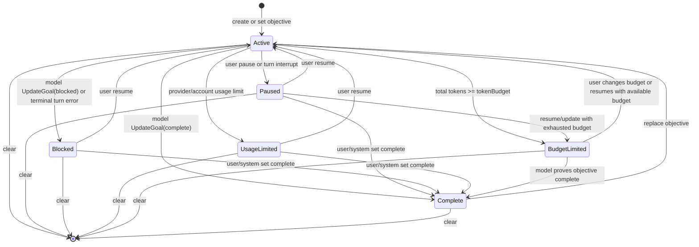

# DotCraft Goal Design Specification

| Field | Value |
|-------|-------|
| **Version** | 0.3.0 |
| **Status** | Living |
| **Date** | 2026-09-06 |
| **Parent Specs** | [Session Core](../architecture/session-core.md), [AppServer Protocol](../protocols/appserver-protocol.md) |

Purpose: Define DotCraft's server-managed persistent thread goal feature, including the Session Core domain model, runtime lifecycle, persistence contract, model tool surface, AppServer wire projection, and client UX expectations.

## Table of Contents

- [1. Scope](#1-scope)
- [2. Design Intent](#2-design-intent)
- [3. System Architecture](#3-system-architecture)
- [4. Domain Model](#4-domain-model)
- [5. State Machine](#5-state-machine)
- [6. Persistence](#6-persistence)
- [7. Session Core Contract](#7-session-core-contract)
- [8. Runtime Lifecycle](#8-runtime-lifecycle)
- [9. Model Tool Surface](#9-model-tool-surface)
- [10. AppServer Protocol Projection](#10-appserver-protocol-projection)
- [11. Client UX Contract](#11-client-ux-contract)
- [12. Automations and Long-Running Work](#12-automations-and-long-running-work)
- [13. Concurrency and Ordering](#13-concurrency-and-ordering)
- [14. Failure Model](#14-failure-model)
- [15. Security and Prompt Safety](#15-security-and-prompt-safety)
- [16. Configuration and Capability Gating](#16-configuration-and-capability-gating)
- [17. Acceptance](#17-acceptance)

---

## 1. Scope

### 1.1 What This Spec Defines

This specification defines a persistent goal attached to a server-managed Session Core thread.

A goal is a user-declared long-running objective that DotCraft can continue over time. It is persisted, resumed with the thread, tracked for token and elapsed-time usage, and advanced by Session Core when the thread is idle.

This spec covers:

- the `ThreadGoal` domain model
- status transitions and lifecycle rules
- persistence in `.craft/state.db`
- Session Core APIs and events
- goal-aware runtime accounting
- automatic continuation turns
- model-visible goal tools
- AppServer JSON-RPC methods and notifications
- client UX expectations for Desktop, ACP, external channels, and custom clients

### 1.2 Relationship to Other Specs

| Spec | Relationship |
|------|--------------|
| `session-core.md` | Owns Thread / Turn / Item lifecycle. Goal state is an extension of the Thread domain model and is executed by Session Core. |
| `appserver-protocol.md` | Projects Session Core goal APIs to out-of-process clients through JSON-RPC. |
| `automations-lifecycle.md` | Automations may bind to or resume goal-backed threads, but goal state remains owned by Session Core. |
| `desktop-client.md` | Client UX may expose goal controls, but this spec defines behavior rather than visual layout. |

### 1.3 In Scope Channels

Goals apply only to server-managed channels that execute through the session service: the CLI, ACP, Desktop through AppServer, the [first-party channel adapters](../sdk/typescript.md#171-first-party-modules) and any other adapter that submits server-managed turns, and Automations when they submit to server-managed threads.

### 1.4 Non-Goals

- This spec does not make arbitrary user prompts into goals. Goal creation is explicit.
- This spec does not introduce multi-goal queues. A thread has at most one current goal.
- This spec does not redefine model orchestration or replace `Microsoft.Extensions.AI`.
- This spec does not require automatic background execution while no DotCraft process is running.
- This spec does not allow the model to pause, resume, abandon, or budget-limit a goal by itself.

---

## 2. Design Intent

Design intent:

1. **Thread-owned durable state**: The current goal belongs to a Session Core thread, not to a UI client or channel adapter.
2. **Single authoritative state machine**: Session Core owns status transitions, accounting, continuation, and model steering.
3. **Thin clients**: Clients can set, clear, pause, resume, and display goals, but they do not own the goal runtime.
4. **Protocol symmetry**: AppServer exposes goal methods using the same JSON-RPC shape and notification style as other thread methods.
5. **Safe autonomy**: An active goal may continue automatically only when the thread is idle and no user or system work is pending.
6. **Model-limited control**: The model can read goals, explicitly create goals when requested, and mark a goal complete or genuinely blocked after the required audit. It cannot suppress or alter the user's control over goal execution.
7. **Budget-aware stopping**: Token budget exhaustion is system-owned. It produces `budgetLimited`, steering, and UI feedback, not silent continuation.

---

## 3. System Architecture

### 3.1 Layering

```text
Client UX
  Desktop / ACP / Bot adapters / custom clients
      |
      | goal commands, buttons, AppServer JSON-RPC
      v
AppServer Protocol Projection
  thread/goal/get
  thread/goal/set
  thread/goal/clear
  thread/goal/updated
  thread/goal/cleared
      |
      v
Session Core
  ThreadGoal domain model
  goal lifecycle service
  goal runtime accounting
  automatic continuation
  model goal tools
      |
      v
Persistence
  .craft/state.db thread_goals table
  thread JSONL history for goal-originated turns and system notices
```

### 3.2 Ownership Boundaries

| Component | Owns |
|-----------|------|
| Session Core | Goal model, state transitions, accounting, continuation, model tools, events, persistence calls. |
| AppServer | Wire DTOs, JSON-RPC routing, subscription/broadcast delivery, capability advertisement. |
| Client adapters | Command parsing, menu/buttons, local presentation, user confirmations. |
| Persistence layer | Atomic goal storage and usage updates in `.craft/state.db`. |
| AgentFactory/tool pipeline | Injection of goal tools when enabled and supported by the thread. |

Adapters must not implement independent goal state machines. A channel may expose `/goal`, but the command must translate to Session Core or AppServer goal operations.

### 3.3 Feature Positioning

Goals are a Session Core capability with optional UX surfaces. A host can expose the capability only when all of these are true:

- Session Core is available.
- The thread is persisted in `.craft/state.db`.
- Goal feature configuration is enabled.
- The effective agent tool pipeline can inject the goal tools, or the host intentionally exposes only user-controlled goal APIs.

---

## 4. Domain Model

### 4.1 ThreadGoal

`ThreadGoal` is the current persisted goal for a `SessionThread`.

A goal carries the fields below. Its public wire projection is defined in §10.2.

Field semantics:

| Field | Type | Semantics |
|-------|------|-----------|
| `ThreadId` | string | Owning Session Core thread id. |
| `GoalId` | string | Stable identity for the current logical goal. Replaced when objective replacement resets usage. |
| `Objective` | string | User-declared goal objective. It is user data, not higher-priority instructions. |
| `Status` | status enum | Current lifecycle state. |
| `TokenBudget` | integer or null | Optional positive total-token budget. `null` means unbounded. |
| `TokensUsed` | token usage breakdown | Cumulative billing token usage attributed to this goal. |
| `TimeUsedSeconds` | integer | Cumulative elapsed wall-clock seconds attributed to this goal. |
| `CreatedAt` | UTC timestamp | UTC timestamp when this logical goal was created. |
| `UpdatedAt` | UTC timestamp | UTC timestamp for the latest mutation or accounting update. |

`TokensUsed` is the shared DotCraft token usage breakdown, not a single integer, so input, output, cache, and reasoning components are preserved while still allowing a total-token budget check.

Budget checks use the total-token component of `TokensUsed`.

### 4.2 ThreadGoalStatus

Statuses and their wire values:

| Status | Wire |
|--------|------|
| `Active` | `"active"` |
| `Paused` | `"paused"` |
| `Blocked` | `"blocked"` |
| `UsageLimited` | `"usageLimited"` |
| `BudgetLimited` | `"budgetLimited"` |
| `Complete` | `"complete"` |

Status semantics:

- `Active`: Session Core may continue this goal when the thread is idle.
- `Paused`: The goal is preserved but will not continue automatically.
- `Blocked`: The model or runtime determined progress is blocked. The goal is preserved but will not continue automatically until the user resumes or replaces it.
- `UsageLimited`: Provider or account usage limits stopped progress. The goal is preserved but will not continue automatically until the user resumes or replaces it.
- `BudgetLimited`: The goal reached or exceeded its token budget. DotCraft should not begin new substantive goal work until the user changes the goal or budget.
- `Complete`: The objective has been achieved. This is terminal for the current logical goal.

### 4.3 Goal Mutations

Goal mutations are patch-like: an omitted field leaves the stored value unchanged.

A goal mutation carries an optional replacement `Objective`, an optional `Status`, and an optional `TokenBudget`.

`TokenBudget` has three states:

- omitted: leave unchanged
- `null`: clear budget
- positive integer: replace budget

`Objective` is always trimmed before validation. Empty objectives are invalid.

### 4.4 Validation

| Rule | Error |
|------|-------|
| `Objective` is empty after trim | Invalid request / invalid operation. |
| `Objective` exceeds 4000 Unicode scalar characters | Invalid request / invalid operation. |
| `TokenBudget <= 0` when provided | Invalid request / invalid operation. |
| Thread does not exist | Thread not found. |
| Thread is ephemeral or not persisted in state DB | Goals unsupported for this thread. |
| Mutating status or budget without an existing goal | Invalid params / invalid operation. |

Clients should enforce the objective length limit before sending, but Session Core remains authoritative.

---

## 5. State Machine

### 5.1 State Diagram



### 5.2 Replacement Rules

`SetThreadGoal` with an objective follows these rules:

1. If no goal exists, create a new active goal by default.
2. If a goal exists, an AppServer/user `objective` update changes the objective in place and preserves `GoalId`, usage, and `CreatedAt`.
3. Status-only or budget-only updates require an existing goal.
4. Model `CreateGoal` uses create-only semantics: it fails while an unfinished goal exists, and creates a new logical goal only after the current goal is `Complete`.
5. Explicit internal/admin replacement may create a new `GoalId` and reset usage, but this is not part of the public AppServer `thread/goal/set` wire contract.

### 5.3 Status Protection

Session Core and persistence must protect system-owned terminal states:

- A `BudgetLimited` goal must not be downgraded to `Paused` by a pause request.
- A `Complete` goal must not become `Active` unless the operation is an explicit replacement or an explicit admin/system mutation that resets the logical goal.
- `Blocked` and `UsageLimited` are stopped states and must not auto-continue.
- If a goal is set to `Active` while `TokenBudget` is present and `TokensUsed.TotalTokens >= TokenBudget`, the stored status becomes `BudgetLimited`.

### 5.4 Clear

Clearing deletes the current goal row. It does not delete turns, usage events, or prior history.

Clients must treat `clear` as idempotent:

- first clear returns `cleared: true`
- later clears return `cleared: false`

---

## 6. Persistence

### 6.1 SQLite Table

Goals are stored in `.craft/state.db`.

```sql
CREATE TABLE thread_goals (
    thread_id TEXT PRIMARY KEY NOT NULL REFERENCES threads(id) ON DELETE CASCADE,
    goal_id TEXT NOT NULL,
    objective TEXT NOT NULL,
    status TEXT NOT NULL CHECK(status IN ('active', 'paused', 'blocked', 'usage_limited', 'budget_limited', 'complete')),
    token_budget INTEGER,

    input_tokens INTEGER NOT NULL DEFAULT 0,
    output_tokens INTEGER NOT NULL DEFAULT 0,
    cached_input_tokens INTEGER NOT NULL DEFAULT 0,
    cache_write_input_tokens INTEGER NOT NULL DEFAULT 0,
    reasoning_output_tokens INTEGER NOT NULL DEFAULT 0,
    total_tokens INTEGER NOT NULL DEFAULT 0,

    time_used_seconds INTEGER NOT NULL DEFAULT 0,
    created_at_utc TEXT NOT NULL,
    updated_at_utc TEXT NOT NULL
);
```

Notes:

- `thread_id` is the primary key to enforce one current goal per thread.
- `goal_id` is a logical concurrency guard used by accounting and continuation paths.
- `total_tokens` is persisted for atomic budget checks and must equal the sum of the stored token fields.

### 6.2 Persistence API

The persistence layer must provide atomic read, insert, replace, update, pause, delete, and usage-accounting operations for the current goal of a thread. Update and accounting operations must accept an expected goal id so a caller can refuse to write against a goal that has since been replaced.

### 6.3 Accounting Modes

Each accounting call declares which statuses are eligible for the usage update, so a status change racing the write cannot silently drop or misattribute usage:

| Accounting path | Eligible statuses |
|-----------------|-------------------|
| Interrupt pause, before the status change | `active` |
| Normal turn and tool accounting | `active`, `budget_limited` |
| Completion accounting, where final usage must be preserved | `active`, `budget_limited`, `complete` |
| External mutation and recovery paths that must account stopped in-flight work | `active`, `paused`, `blocked`, `usage_limited`, `budget_limited` |

### 6.4 Atomic Budget Check

Usage accounting must update usage and budget status atomically. The update accumulates all token and time deltas, flips `status` from `active` to `budget_limited` when the new `total_tokens` meets or exceeds `token_budget`, and applies the expected-goal-id guard to reject stale in-flight accounting. When nothing matches — wrong `goal_id`, ineligible status, or no goal — the operation reports that it changed nothing and returns the current goal if one exists.

---

## 7. Session Core Contract

### 7.1 Service Surface

The session service exposes three goal operations: read the current goal, set it, and clear it. Clearing reports whether a goal was actually removed.

A set operation carries a mode, which is a runtime concern and never an AppServer wire field:

| Mode | Behavior |
|------|----------|
| Upsert or update | Create, replace, or update according to the replacement rules in §5.2. This is the default. |
| Create only | Create only when no unfinished current goal exists; a completed current goal may be replaced. |
| Update only | Update status or budget only when a current goal exists. |
| Replace existing | Force objective replacement after a client confirmation. |

### 7.2 Internal Runtime Events

Callers report runtime facts — a turn started, usage arrived, a tool or turn finished, a turn was cancelled, an external mutation is about to be written, a thread resumed, the thread may now be idle — and goal runtime alone decides how accounting, continuation, and notifications change. Callers never decide those themselves.

### 7.3 Session Events

Session Core should emit goal events through the same event broker used for thread and turn events.

Recommended event names:

- `thread/goal/updated`
- `thread/goal/cleared`

Payloads:

```json
{
  "threadId": "thread_...",
  "turnId": "turn_001",
  "goal": { "...": "ThreadGoalWire" }
}
```

```json
{
  "threadId": "thread_..."
}
```

`turnId` is optional. It is present when the goal update was caused by a specific turn.

### 7.4 Turn Provenance for Goal Continuation

Goal continuation turns are ordinary persisted turns with special provenance.

The continuation turn's user-message input uses:

- `triggerKind = "goal"`
- `triggerLabel = "Goal continuation"` or a localized equivalent
- `triggerRefId = internal goalId`
- `channelName = "goal"` or the host's internal goal origin name

Clients may use this to render the turn as system-initiated goal work, not as a typed user message.

Initial goal submission is different from goal continuation. When a user submits an objective that creates or replaces the goal, the objective remains user-authored input and is rendered as an ordinary user message; it must not use `triggerKind = "goal"`.

The model-visible input is not the raw objective alone. It is a hidden developer/system steering message generated by Session Core.

#### Origin-Turn Provenance ("sent as goal")

Clients commonly badge the user message that established the goal. That badge MUST come from durable provenance, never from inference:

- The client sets `sentAsGoal = true` on the `turn/start` submission carrying the goal objective, including the first-turn submission a goal-first thread makes after `thread/goal/set`.
- Session Core persists the marker on the resulting user-message item, alongside provenance such as `triggerKind`. It survives process restart, `thread/resume`, and replay.
- AppServer projects it on the user-message item; the wire field is defined by [AppServer Protocol §6.3](../protocols/appserver-protocol.md#63-item-notifications).
- A goal mutation that does not originate from a user turn — a status-only pause or resume, a budget change, or a model `UpdateGoal` — produces no marker. State for those is carried by the goal snapshot and notifications (§7.3, §10.6).

Because the marker rides on an item that is persisted anyway, no separate goal-event history item exists.

Text correlation is unsound and MUST NOT be used: it false-positives after objective replacement, with short or repeated objectives, when the originating turn is absent (for example after compaction) so a later message becomes the first text match, and when a casual reply coincidentally equals the objective. The marker records the immutable historical fact that a specific message established a goal; the objective is mutable, so the two must never be correlated by value.

---

## 8. Runtime Lifecycle

### 8.1 Turn Start

When a turn starts:

1. Goal runtime records the current cumulative token usage as the turn baseline.
2. If goals are disabled, no further goal work is performed.
3. If the current thread mode ignores goals, active goal accounting is cleared for the turn.
4. Runtime reads the current goal from state DB.
5. If the goal is `Active` or `BudgetLimited`, runtime marks the current `GoalId` as active for turn and wall-clock accounting.

### 8.2 Usage Delta

Goal runtime consumes the same normalized billing usage that drives `usage/delta`.

On each usage delta:

1. If the current turn has an active `GoalId`, record the latest billing usage for that turn.
2. Do not persist goal usage, emit `thread/goal/updated`, or inject budget-limit steering from the raw usage-delta path.
3. Flush recorded usage only at safe lifecycle boundaries such as tool completion and turn finish.

Goal runtime must not derive token usage from context-window occupancy. It uses billing token usage only.

### 8.3 Tool Completion

After each tool handler except `UpdateGoal` completes:

- runtime flushes accumulated goal usage with the active `GoalId` kept active when the status becomes `BudgetLimited`
- if the flushed status is `BudgetLimited`, budget-limit steering is injected into the active turn once per `GoalId`
- terminal metrics are emitted when status changes

Blocked, unknown, policy-denied, or cancelled tool calls that never reached the tool handler do not flush goal usage.

After `UpdateGoal` completes:

- runtime first accounts progress with budget steering suppressed
- then applies the status update to `Complete` or `Blocked`
- completion accounting is preserved when the update marks the goal complete

### 8.4 Turn Finish

On successful turn completion, final usage and elapsed time are accounted before `turn/completed` is emitted. Turn-scoped accounting is then cleared; if final accounting makes the goal `BudgetLimited`, no budget-limit steering is injected, because there is no longer a turn to receive it. If the goal remains `Active`, Session Core evaluates idle continuation only after the completion path has drained queued-work decisions.

### 8.5 Turn Interrupt or Cancellation

If a user interrupts an active turn:

1. Runtime accounts progress made before interruption.
2. If the current goal is `Active`, runtime changes it to `Paused`.
3. Runtime emits `thread/goal/updated` with `turnId = null`.
4. The turn continues its normal cancellation lifecycle.

If the turn is cancelled for non-user reasons, DotCraft may account progress but should not automatically pause unless the cancellation represents user intent.

### 8.6 External Mutation

External mutation means a client or adapter calls `SetThreadGoalAsync` or `ClearThreadGoalAsync` while a thread may be running.

Before writing the mutation:

- if a turn is active, runtime accounts in-flight progress with budget steering suppressed
- if no turn is active, runtime accounts wall-clock usage for the active goal

After writing:

- `Active`: mark goal active in runtime and evaluate idle continuation
- `Paused` or `Complete`: clear active accounting
- `BudgetLimited`: clear stopped accounting if no active turn exists
- `Cleared`: clear all active goal accounting

### 8.7 Thread Resume

When a persisted thread is resumed:

1. Session Core loads thread and goal state.
2. AppServer sends the normal `thread/resumed` response/notification.
3. AppServer or Session Core emits a goal snapshot:
   - `thread/goal/updated` when a goal exists
   - `thread/goal/cleared` when no goal exists
4. Only after the resume snapshot is observable should runtime evaluate active goal continuation.

This ordering prevents clients from seeing a continuation turn before they know the resumed goal state.

### 8.8 Automatic Continuation

Session Core may start a goal continuation turn when all conditions are true:

- goals are enabled
- current thread has a goal with status `Active`
- thread is not archived or paused
- thread mode does not ignore goals
- no turn is active
- no queued input is ready
- no guidance input is pending
- no approval is waiting
- no plan confirmation is waiting
- no higher-priority automation trigger is pending for the same thread
- the persisted goal still has the same `GoalId` immediately before launch

Continuation must reserve the active turn slot before injecting input, then re-check that the goal is still current.

### 8.9 Continuation Prompt

The continuation prompt is generated by Session Core and inserted as a developer/system steering message, never as a user message. It must give the model the objective framed as untrusted data (§15.1), the current budget position — token usage, token budget, elapsed time, and remaining tokens — and the audit obligations of §15.3 and §15.4 that gate `UpdateGoal`.

### 8.10 Budget-Limit Steering

When a goal becomes `BudgetLimited` at a tool-completion boundary, runtime injects a developer/system steering message into the active turn if one exists.

Budget-limit steering is turn-scoped internal context. It must not be represented as a `QueuedTurnInput`, must not use `guidancePending`, must not create a `UserMessage` item, and must not start a follow-up turn. If the current turn cannot drain the steering before it ends, the steering is discarded.

The message must tell the model that the goal reached its token budget, that it must start no new substantive work for this goal and should wrap up, and that budget exhaustion is by itself never grounds for `UpdateGoal(complete)` or `UpdateGoal(blocked)` (§15.5).

---

## 9. Model Tool Surface

### 9.1 Tool Injection Rules

Goal tools are injected only when:

- goals are enabled
- the thread is persisted
- the agent is running through Session Core
- the role/tool policy permits goal tools

Operational modes should not remove goal tool schemas solely to restrict behavior, because changing the model-visible tool surface breaks prompt cache reuse across ordinary mode transitions. For main Session Core threads, goal tool schemas remain stable across `agent` and `plan`; mode-specific restrictions are enforced by execution policy and prompt guidance.

SubAgents do not receive goal control tools by default. A role that enables them gets goal state on the child thread that is separate from the parent thread's.

### 9.2 Tools

DotCraft should expose three built-in model tools.

#### `GetGoal`

Purpose: Read current thread goal.

Arguments: none.

Result:

```json
{
  "goal": null,
  "remainingTokens": null
}
```

or:

```json
{
  "goal": { "...": "ThreadGoalWire" },
  "remainingTokens": 12000
}
```

#### `CreateGoal`

Purpose: Create a goal only when explicitly requested by the user, system, or developer instructions.

Arguments:

```json
{
  "objective": "Improve benchmark coverage",
  "tokenBudget": 50000
}
```

Rules:

- Fails if a current goal already exists.
- Does not infer goals from ordinary tasks.
- Sets `tokenBudget` only when a budget is explicitly requested.

#### `UpdateGoal`

Purpose: Mark the current goal complete or genuinely blocked.

Arguments:

```json
{ "status": "complete" }
```

or:

```json
{ "status": "blocked" }
```

Rules:

- Accepted `status` values are `"complete"` and `"blocked"`.
- The tool rejects pause, resume, budget-limit, or arbitrary status updates.
- The model must use this only after a completion audit proves the objective is achieved.
- The model may use `"blocked"` only after the same blocking condition repeats for at least three consecutive goal turns and progress is truly at an impasse.
- If the completed goal had a budget, the tool result must include a final budget report for the model to relay to the user.

### 9.3 Model Tool Results

All tool results are JSON text. The common fields are `goal` (`ThreadGoalWire` or `null`) and `remainingTokens` (`number` or `null`). `UpdateGoal(complete)` additionally includes `completionBudgetReport` with final usage the model should relay to the user.

---

## 10. AppServer Protocol Projection

### 10.1 Capability

`initialize` response adds:

```json
{
  "capabilities": {
    "threadGoals": true
  }
}
```

Clients must check `capabilities.threadGoals` before calling `thread/goal/*`.

### 10.2 Wire DTOs

`ThreadGoalWire`:

```json
{
  "threadId": "thread_20260906_abcd",
  "objective": "Improve benchmark coverage",
  "status": "active",
  "tokenBudget": 50000,
  "tokensUsed": 1500,
  "timeUsedSeconds": 240,
  "createdAt": 1788688800,
  "updatedAt": 1788689040
}
```

The public wire shape intentionally omits internal `goalId` and token breakdown fields. C# storage may retain `goal_id`, input/output/cache/reasoning token columns, and ISO timestamps internally; AppServer and goal tools expose only the public scalar total-token and Unix-second projection.

### 10.3 `thread/goal/get`

Direction: client to server request. Params carry `threadId`. The result is `{ "goal": ThreadGoalWire | null }`.

### 10.4 `thread/goal/set`

Direction: client to server request.

Fields:

| Field | Type | Required | Description |
|-------|------|----------|-------------|
| `threadId` | string | yes | Target thread. |
| `objective` | string | no | New or replacement objective. Omitted when only status/budget changes. |
| `status` | string | no | Desired status. |
| `tokenBudget` | number or null | no | Omitted leaves unchanged, null clears, positive number sets. |

The result is `{ "goal": ThreadGoalWire }`.

Behavior:

- The server validates the request against Session Core rules.
- With `objective`, the server creates a goal when none exists or updates the existing objective in place.
- Status-only and budget-only updates require an existing goal.
- The `mode` field is not part of the public protocol; a request carrying `mode` is rejected with invalid params.
- The server emits `thread/goal/updated` after mutation.

### 10.5 `thread/goal/clear`

Direction: client to server request. Params carry `threadId`. The result is `{ "cleared": boolean }`.

Behavior:

- The server deletes the current goal if present.
- `cleared: false` means no current goal existed.
- The server emits `thread/goal/cleared` only when state changed.

### 10.6 Notifications

#### `thread/goal/updated`

Workspace-level broadcast plus thread-subscription delivery.

```json
{
  "jsonrpc": "2.0",
  "method": "thread/goal/updated",
  "params": {
    "threadId": "thread_20260906_abcd",
    "turnId": "turn_001",
    "goal": { "...": "ThreadGoalWire" }
  }
}
```

#### `thread/goal/cleared`

Same envelope, method `thread/goal/cleared`, with `threadId` alone in `params`.

### 10.7 Notification Delivery

Goal notifications are summary notifications like `thread/runtimeChanged`, not turn-scoped item events.

Rules:

- They are broadcast to initialized connections unless opted out.
- Connections subscribed to the thread also receive them through the normal subscription dispatcher.
- AppServer must avoid duplicate delivery when the same connection has an active subscription and also receives workspace broadcasts. Implementations may dedupe by `(method, threadId, goal.updatedAt)` or use one delivery path per connection.
- `turnId`, when present, allows clients to annotate the turn that caused the update.

### 10.8 Thread Read/List Hydration

`thread/read`, `thread/start`, `thread/resume`, and `thread/list` may include an optional current goal snapshot:

```json
{
  "goal": { "...": "ThreadGoalWire" }
}
```

This is a hydration optimization. Clients must still consume `thread/goal/updated` and `thread/goal/cleared` as the incremental source of truth.

The field is optional and a server may omit it even when a goal exists. Clients call `thread/goal/get` when they need an authoritative snapshot.

In addition to the current-goal snapshot, the durable `sentAsGoal` marker on user-message items (§7.5) is projected inline in the thread's item stream, so clients reconstruct the "sent as goal" association deterministically from history rather than from a live heuristic.

### 10.9 Error Codes

AppServer does not require dedicated goal-specific error codes. Servers should use the normal JSON-RPC/AppServer errors:

- the capability-unsupported error when goals are disabled or the thread cannot hold a goal
- thread-not-found for missing threads
- invalid-params for a malformed status, an invalid objective, an invalid budget, a `mode` field, or a status/budget mutation with no current goal
- internal-error for unexpected persistence/runtime failures

---

## 11. Client UX Contract

### 11.1 Common Commands

Clients that expose slash commands should support:

| Command | Behavior |
|---------|----------|
| `/goal` | Show current goal summary, or usage if no goal exists. |
| `/goal <objective>` | Set or replace the current goal after validation and replacement confirmation. |
| `/goal pause` | Set current goal status to `paused`. |
| `/goal resume` | Set current goal status to `active`. |
| `/goal clear` | Clear current goal. |

Clients may expose equivalent buttons or menus instead of slash commands.

### 11.2 `/goal <objective>` Before Thread Start

When a client has not yet created a thread:

- Desktop may create the thread first, call `thread/goal/set`, then submit the objective text as the first normal `turn/start` input so conversation history shows the user's goal as the first user message.
- Control commands (`pause`, `resume`, `clear`) should not be queued before a thread exists.

### 11.3 Replacement Confirmation

Before replacing an existing non-complete goal, interactive clients should ask for confirmation.

Suggested choices:

- Replace current goal
- Cancel

The confirmation is a UX responsibility, but Session Core remains safe if a client sends `replaceExisting` directly.

### 11.4 Status Display

Clients should display a compact goal status where space allows:

| Status | Suggested label |
|--------|-----------------|
| `active` | `Pursuing goal (...)` |
| `paused` | `Goal paused (/goal resume)` |
| `budgetLimited` | `Goal budget reached (...)` or `Goal unmet (...)` |
| `complete` | `Goal achieved (...)` |

Usage display preference:

1. If `tokenBudget` exists, show `tokensUsed / tokenBudget`.
2. Otherwise show elapsed time.

### 11.5 Goal Summary

The detailed summary should include:

- status
- objective
- elapsed time
- token usage
- token budget when present
- available commands/actions based on status

### 11.6 Paused Goal Resume Prompt

After `thread/resume`, if the current goal is `Paused`, interactive clients may show:

- Resume goal
- Leave paused

Choosing resume calls `thread/goal/set` with `status = "active"`.

### 11.7 Identifying the "Sent as Goal" Message

A client that badges the user message which established the goal MUST read the persisted `sentAsGoal` marker on the user-message item (§7.5). Clients MUST NOT correlate by matching message text to the current objective, because the objective is mutable and short/duplicate/replaced objectives produce false positives on unrelated messages.

---

## 12. Automations and Long-Running Work

Automations may interact with goals in two ways:

1. **Bound task continuation**: An automation can submit turns into a thread that already has an active goal. Session Core accounts the work toward the goal.
2. **Goal bootstrap**: An automation template may explicitly create a goal before submitting work.

Rules:

- Automations do not own goal state.
- A recurring automation must not silently replace a user's current goal unless the task definition explicitly says so.
- Unattended goal continuation must still respect token budget and approval policy.
- If a goal becomes `BudgetLimited`, automations should not keep submitting substantive goal work without user intervention.

---

## 13. Concurrency and Ordering

### 13.1 GoalId Guard

Every accounting snapshot stores the active `GoalId`. Usage updates should pass `expectedGoalId`.

This prevents:

- an old turn from adding usage to a newly replaced goal
- delayed tool completion from resurrecting stale state
- continuation launched for one goal from mutating another goal

### 13.2 Per-Thread Mutual Exclusion

Session Core enforces one active turn per thread. Goal continuation must use the same per-thread execution gate.

If a user input arrives while a goal continuation is being prepared, user input has priority. The continuation is abandoned before the turn starts; if it has already started, the user input is queued under the normal queue semantics.

### 13.3 Accounting Lock

Goal accounting must serialize:

- token baseline reads
- wall-clock delta reads
- state DB usage updates
- baseline resets
- budget-limit steering emission

This can be a per-thread goal accounting lock inside Session Core.

### 13.4 Continuation Lock

Goal continuation must serialize across:

- resume
- turn completion
- external status changes
- automation triggers
- reconnect/subscription recovery

At most one continuation turn may be reserved or launched for a thread at a time.

### 13.5 Notification Ordering

For running threads:

- `thread/goal/updated` caused by a turn must be ordered with that turn's event stream.
- Resume goal snapshots must be ordered after `thread/resumed` and before automatic continuation notifications.
- External goal mutations should emit the JSON-RPC response before the matching notification, matching AppServer request/notification style.

---

## 14. Failure Model

| Failure | Behavior |
|---------|----------|
| State DB unavailable | Goal operations fail. Turns in flight continue without goal behavior. |
| Goal accounting write fails during a turn | Log warning, continue turn, and retry on next accounting boundary when possible. |
| Goal set fails while a turn is running | In-flight accounting remains in memory; client receives error. |
| Continuation launch fails | Emit/log system error; leave goal status unchanged unless failure is caused by budget limit or explicit user cancellation. |
| Budget-limit steering injection fails because no turn is active | Do not fail the goal update. The next active turn sees status `BudgetLimited`. |
| Client disconnects after setting a goal | Server-owned thread state persists; active turns continue according to AppServer rules. |
| Approval required during continuation on non-interactive client | The normal approval fallback policy applies. |
| Thread deleted | DB cascade removes goal; clients receive normal thread deletion notifications. |

---

## 15. Security and Prompt Safety

### 15.1 Objective Is Untrusted

The objective is user-provided data. Continuation and budget-limit prompts must frame it as untrusted content.

Required pattern:

```xml
<untrusted_objective>
...
</untrusted_objective>
```

The prompt must explicitly say the objective is the task to pursue, not higher-priority instructions.

### 15.2 Model Authority Limits

The model's authority over a goal is exactly the three tools of §9.2 and no more. Control of pausing, resuming, clearing, budgeting, and replacing the objective belongs to the user, and no prompt, tool result, or objective text may extend the model's authority past that boundary.

### 15.3 Completion Audit

A goal is never marked complete on the model's impression that it is done. Before `UpdateGoal(complete)`, the continuation prompt must require the model to verify each deliverable against inspected evidence — files, command output, tests, PR state, or runtime state — and to treat any requirement it cannot evidence, and any residual uncertainty, as incomplete.

### 15.4 Blocked Audit

Before `UpdateGoal(blocked)`, the continuation prompt must require a blocked audit:

- do not mark blocked the first time a blocker appears
- require the same blocking condition to repeat for at least three consecutive goal turns
- require a true impasse that cannot make meaningful progress without user input or external-state change
- never use blocked merely because the work is hard, slow, uncertain, incomplete, or would benefit from clarification

### 15.5 Budget Safety

Budget exhaustion is not completion. The budget-limit prompt must explicitly forbid marking the goal complete merely because budget is exhausted or work is stopping.

---

## 16. Configuration and Capability Gating

### 16.1 Workspace Configuration

Workspace config:

```json
{
  "Goals": {
    "Enabled": true,
    "AutoContinueEnabled": true
  }
}
```

Defaults for the runtime implementation:

| Setting | Default | Notes |
|---------|---------|-------|
| `Goals.Enabled` | `true` | Enables goal storage, AppServer methods, prompt injection, accounting, and model goal tools. |
| `Goals.AutoContinueEnabled` | `true` | Enables idle continuation turns for active goals. Users can pause a goal to stop continuation. |

When `Goals.Enabled = false`, AppServer does not advertise `threadGoals`, `thread/goal/*` returns the capability-unsupported error of §10.9, model goal tools are omitted, and persisted goals remain inert.

When `Goals.AutoContinueEnabled = false`, AppServer still advertises `threadGoals`; clients can set/read/clear goals, goal context is injected into normal turns, usage accounting and budget steering still run, but Session Core must not start automatic idle continuation turns.

### 16.2 AppServer Capability

AppServer advertises `capabilities.threadGoals = true` only when the current server can service the complete goal runtime contract in this spec. The capability means more than storage APIs: clients may expect prompt-visible goal context, accounting, budget transitions, and model goal tools. Automatic idle continuation still depends on `Goals.AutoContinueEnabled`.

### 16.3 Mode Interaction

Planning-only modes deny goal execution but keep the goal tool surface visible, so prompt cache reuse survives ordinary mode transitions (§9.1):

| Mode | Goal tool schemas | Goal tool execution | Continuation |
|------|-------------------|---------------------|--------------|
| `agent` | visible | permitted | enabled |
| `plan` | visible | denied by mode policy | disabled |

Every mode must declare whether it permits goal tools, goal accounting, and goal continuation.

Accounting for work in flight may still occur during mode transitions to avoid usage loss.

---

## 17. Acceptance

- A persisted thread can hold one current goal.
- Goal survives process restart and thread resume.
- AppServer clients can manage goals through JSON-RPC.
- Session Core accounts token and elapsed-time usage.
- Token budget exhaustion changes status to `budgetLimited`.
- Active goals continue only when the thread is idle.
- User input and approvals take priority over automatic continuation.
- The model can mark completion but cannot control pause/resume/budget.
- Clients can hydrate and update goal UI from protocol snapshots and notifications.
